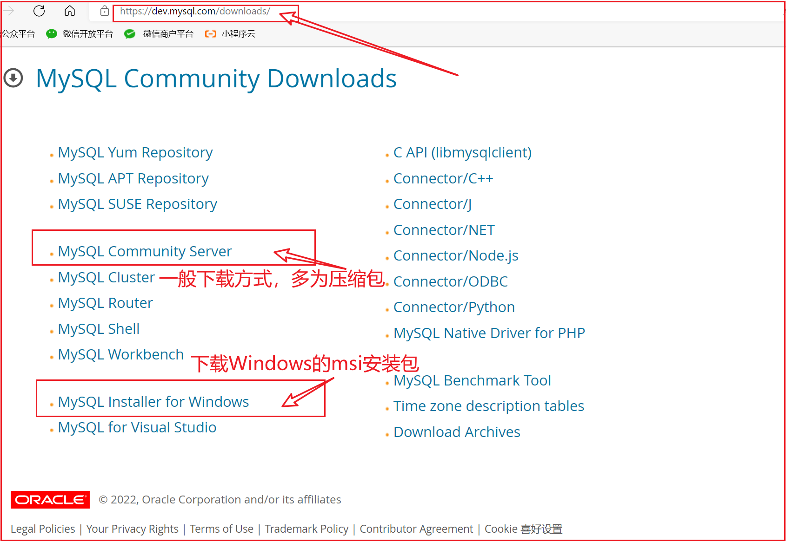

---

order: 15
title:  MySQL数据库

---

MySQL5.7文档：https://dev.mysql.com/doc/refman/5.7/en/ 

MySQL8.0文档：https://dev.mysql.com/doc/refman/8.0/en/ 


## MySQL的安装和配置

MySQL是一个C/S架构的软件，我们安装的MySQL 是服务端。


### Windows平台

下载MySQL：https://dev.mysql.com/downloads/mysql/




::: info Windows平台下的安装步骤

将压缩包解压到需要安装的目录，然后执行以下步骤：

1. 新建配置文件 my.ini ，存放的路径为MySQL的根目录，文件内容如下：
  ```bash
    [client]
    port=3306

    [mysql]
    default-character-set=utf8

    [mysqld]
    character-set-server=utf8
    default-storage-engine=INNODB
    explicit_defaults_for_timestamp=true
    basedir = D:\Develop\Database\mysql-5.7.37
    datadir = D:\Develop\Database\mysql-5.7.37\data
  ```

2. 配置环境变量 （先检查有无正确的环境变量，若没有则需要设置）

	打开MySQL的bin目录，复制此路径，添加到环境变量


3. 初始化MySQL（生成data目录）命令行执行如下命令：(以下命名全部在以管理员模式打开的)
```bash
mysqld --initialize-insecure
```
	
	
4. 注册MySQL服务
```bash
mysqld -install
```
	
5. 启动MySQL服务
```bash
net start mysql
```

6. 修改默认账户密码
```bash
mysqladmin -u root password 123456
```

7. 登录使用 
```bash	
mysql -uroot -p
```

8. 卸载MySQL：
```bash
net stop mysql

mysqld -remove mysql
```	
最后删除MySQL目录及相关的环境变量即可
:::


安装MySQL：参照blog https://blog.csdn.net/drizzletowne/article/details/120896774


### WSL2-Ubuntu

微软官网示例：https://learn.microsoft.com/zh-cn/windows/wsl/tutorials/wsl-database


**问题一**：启动MySQL服务时提示：`su: warning: cannot change directory to/nonexistent...`

主要原因是MySQL 用户的主目录问题：

先停止MySQL服务：`sudo systemctl stop mysql` 或 `sudo service mysql stop`

```bash
getent passwd mysql                      
# 查看当前用户的主目录：mysql:x:113:120:MySQL Server,,,:/nonexistent:/bin/false

sudo usermod -d /var/lib/mysql/ mysql    # 修改用户的主目录
# 修改主目录之前，请确保 /var/lib/mysql/ 目录已经存在，并且是 MySQL 数据文件的正确存放位置
```
修改完后启动MySQL服务：`sudo service mysql start`


更多问题参照：[WSL2 Ubuntu 安装Mysql 避坑记录](https://zhuanlan.zhihu.com/p/654729453)


### Linux手动安装

下为Linux通用版本下载选项（Windows类似）：


::: info Linux平台手动安装MySql

目标：将 `mysql5.7` 安装到  `/usr/local/mysql` (不建议安装到其他位置，可能会导致socket连接失败)

准备：在`/usr/local/` 目录下创建 `mysql` 和 `software` 目录
	

1. 下载 mysql的压缩包 (或上传自己已下载的压缩包到指定目录即可)
```bash
cd /usr/local/software
wget http://dev.MySQL.com/get/Downloads/MySQL-5.7/mysql-5.7.37-Linux-glibc2.12-x86_64.tar.gz
```

2、解压并复制到 mysql目录
```bash
tar -xvf mysql-5.7.37-Linux-glibc2.12-x86_64.tar.gz

mv ./mysql-5.7.37-linux-glibc2.12-x86_64/* /usr/local/mysql/
```


3、安装依赖、创建mysql用户组及其用户
```bash
yum install libaio   （Ubuntu使用：sudo apt-get install libaio1）

groupadd mysql
useradd -r -g mysql -s /bin/false mysql
```


4、创建相关目录、设置权限、初始化mysql 
```bash
cd /usr/local/mysql/

mkdir mysql-files
chown mysql:mysql mysql-files
chmod 750 mysql-files

bin/mysqld --initialize --user=mysql  # 记住末尾自动生成的root密码 如：lZw.qSdCS7pV
bin/mysql_ssl_rsa_setup
bin/mysqld_safe --user=mysql &
```

5. 配置环境变量
```bash
vim /etc/profile.d/mysql.sh  # 在里面加入: 
export PATH=$PATH:/usr/local/mysql/bin

source  /etc/profile  # 使用source命令使修改立刻生效：  
```

6. 将mysql添加到启动项
```bash
cp support-files/mysql.server /etc/init.d/mysql.server

chkconfig --add mysql.server  （ 或 systemctl enable mysql.server）
```

7. 使用 （首次使用需要先修改密码）
```bash
mysql -uroot -p

mysql> alter user user() identified by "123456";
```

8. 启动、关闭和重启
```bash
/etc/init.d/mysql.server start
/etc/init.d/mysql.server stop
/etc/init.d/mysql.server restart
```

9. 其他常用命令
```bash
>mysql status;                            # 查看mysql基本信息
>mysql SHOW VARIABLES LIKE 'character%';  # 查看数据库字符集相关设置信息
```
:::

**Linux下的安装参考**：https://dev.mysql.com/doc/refman/5.7/en/binary-installation.html


简单配置mysql:

```bash
vi /etc/my.cnf   # 添加如下信息：

[client]
port=3306

[mysql]
default-character-set=utf8

[mysqld]
character-set-server=utf8
default-storage-engine=INNODB
```

【注意】关于Linux下没有my.cnf的情形：从5.7.18开始官方不再二进制包中提供my-default.cnf文件。


<br/>


<span style="font:normal bold 22px arial,sans-serif;color:blue">Navicat无法连接Mysql时：</span> 

```shell

1. 打开数据库：use mysql。检索 user 和 host 字段
mysql> use mysql;
mysql> select user, host from user; 

2. 如果没有 user=root ，host = % 的用户，则执行下面语句：
mysql> update user set host='%' where user='root';

3. 给 root 授权（所有权限）, 并让赋予的权限立即生效
mysql> GRANT ALL PRIVILEGES ON *.* TO 'root'@'%' IDENTIFIED BY '123456' WITH GRANT OPTION;
mysql> flush   privileges;

```


### Linux平台-RPM

卸载MySQL：

```shell
1 删除Mysql

   yum remove  mysql mysql-server mysql-libs mysql-server;

   find / -name mysql 将找到的相关东西delete掉(rm -rf /var/lib/mysql)；

   rpm -qa|grep mysql(查询出来的东东yum remove掉)

   rm /etc/my.cnf

 
查看是否还有mysql软件：如果存在的话，继续删除即可。
rpm -qa|grep mysql


a）查看系统中是否以rpm包安装的mysql：

rpm -qa | grep -i mysql


b)卸载mysql

rpm -e MySQL-server-5.6.17-1.el6.i686
rpm -e MySQL-client-5.6.17-1.el6.i686


c)删除mysql服务

chkconfig --list | grep -i mysql
chkconfig --del mysql


d)删除分散mysql文件夹

whereis mysql 或者 find / -name mysql

清空相关mysql的所有目录以及文件
rm -rf /usr/lib/mysql
rm -rf /usr/share/mysql
rm -rf /usr/my.cnf


通过以上几步，mysql应该已经完全卸载干净了.
```


### MySql配置文件

查看mysql启动时读取`my.cnf`配置文件的目录

```bash
mysql --help|grep 'my.cnf'      
```

在 MySQL 中，如果某个配置项在多个配置文件中都出现了，MySQL 服务器会按一定的顺序读取这些配置文件，并且后读取的配置文件中的设置会覆盖先前读取的相同配置项。这意味着即使某个配置项在多个文件中出现，最终生效的是最后读取的那个文件中的值。

::: info MySQL配置文件读取顺序
MySQL 服务器在启动时会按以下顺序读取配置文件：

1. **命令行参数**：通过命令行传递的选项。
2. **环境变量**：例如 `MYSQL_TCP_PORT` 和 `MYSQL_UNIX_PORT`。
3. **全局配置文件**：
   - `/etc/my.cnf`
   - `/etc/mysql/my.cnf`（某些 Linux 发行版）
   - `SYSCONFDIR/my.cnf`（编译时指定的系统配置目录）
4. **用户特定配置文件**：
   - `~/.my.cnf`（当前用户的主目录下的隐藏文件）

**优先级和覆盖规则**：
- **最先读取**：最先读取的是 `/etc/my.cnf` 文件，最后是`~/.my.cnf`.
- **保留的配置**：最终保留的是最后一个读取到的配置文件中的值。
:::


**配置文件结构与内容**：

MySQL 的配置文件通常由多个节（sections）组成，每个节针对不同的功能进行配置。常见的节包括 `[mysqld]`、`[client]`、`[mysql]` 和 `[mysqld_safe]` 等。以下是一个示例配置文件 `/etc/my.cnf`，包含了常用的关键配置项：

```ini
# [client] 节：用于客户端工具（如 mysql 命令行工具）的全局设置
[client]
# 默认字符集：设置客户端默认字符集为 utf8mb4，支持更多字符，包括 Emoji
default-character-set=utf8mb4

# [mysql] 节：用于 mysql 命令行工具的特定设置
[mysql]
# 默认字符集：设置 mysql 命令行工具的默认字符集为 utf8mb4
default-character-set=utf8mb4

# [mysqld] 节：用于 MySQL 服务器的主要设置
[mysqld]
# 服务器监听的 IP 地址：0.0.0.0表示服务器监听所有网络接口
bind-address = 0.0.0.0

# 数据目录：指定 MySQL 数据文件的存储目录
datadir = /var/lib/mysql

# 错误日志文件：指定错误日志文件的位置
log_error = /var/log/mysql/error.log

# 慢查询日志
slow_query_log = 1   # 启用慢查询日志
slow_query_log_file = /var/log/mysql/slow-query.log  # 指定慢查询日志文件的位置
long_query_time = 2  # 慢查询的时间阈值，单位为秒

# 二进制日志
log_bin = /var/lib/mysql/mysql-bin.log  # 指定二进制日志文件的位置
expire_logs_days = 7  # 二进制日志保留天数

# InnoDB 设置
innodb_buffer_pool_size = 1G  # InnoDB 缓冲池大小
innodb_log_file_size = 512M    # InnoDB 日志文件大小
innodb_flush_log_at_trx_commit = 1  # 每个事务提交时刷新日志到磁盘

# 最大连接数
max_connections = 300

# 字符集
character-set-server = utf8mb4         # 服务器默认字符集
collation-server = utf8mb4_unicode_ci  # 服务器默认排序规则

# 性能优化
query_cache_size = 0  # 禁用查询缓存
table_open_cache = 2000  # 表缓存大小
tmp_table_size = 64M  # 内存临时表的最大大小
max_heap_table_size = 64M  # 用户创建的内存表的最大大小

# 安全相关
skip-name-resolve  # 禁用 DNS 解析
local-infile = 0  # 禁用本地文件加载

# [mysqld_safe] 节：用于 mysqld_safe 启动脚本的设置
[mysqld_safe]
# 错误日志文件的位置
log-error = /var/log/mysql/error.log
# 设置打开文件的限制
open-files-limit = 1024

# [mysqldump] 节：用于 mysqldump 工具的设置
[mysqldump]
# 快速导出
quick
# 允许最大数据包大小
max_allowed_packet = 16M
```


### 重置root密码

无论是在 MySQL 5.7 还是 MySQL 8.0 中，设置密码的方法基本相同：

1. **登录 MySQL**

   首先以 root 用户登录 MySQL：

   ```sh
   sudo mysql -u root -p
   ```

2. **设置密码**

   使用 `ALTER USER` 语句设置 root 用户的密码：

   ```sql
   ALTER USER 'root'@'localhost' IDENTIFIED BY '新密码';
   ```

   或者，如果你需要为其他用户设置密码：

   ```sql
   CREATE USER '新用户名'@'localhost' IDENTIFIED BY '新密码';
   ```

   MySql5.7还可以使用下列方式：

    ```bash
    SET PASSWORD FOR 'username'@'localhost' = PASSWORD('新密码');
    # 或者
    SET PASSWORD FOR 'username'@'localhost' = '新密码';
    ```

3. **刷新权限**

   为了确保新设置的密码立即生效，需要刷新权限：

   ```bash
   FLUSH PRIVILEGES;
   ```

4. **退出 MySQL**

   退出 MySQL 命令行：

   ```bash
   EXIT;
   ```


### MySql常用命令

MySQL 客户端提供了丰富的命令来帮助你管理数据库、执行 SQL 语句、查看数据库信息等：

**1. 连接 MySQL 服务器**

```sh
mysql -u username -p
```

- `-u`: 指定用户名。
- `-p`: 提示输入密码。

附加参数:

```sh
mysql -u username -p -h hostname -P port
```

- `-h`: 指定服务器的主机名或 IP 地址。
- `-P`: 指定 MySQL 服务器的端口号，默认为 `3306`。

显示当前连接的 MySQL 版本：
```sql
SELECT VERSION();           
```
帮助命令和退出客户端：
```bash
HELP command_name;   --  显示帮助信息

EXIT;                -- 退出 MySQL 客户端 还可以使用 QUIT;
```

**2. 使用数据库**

查看数据库列表，并选择需要使用的数据库：
```sql
SHOW DATABASES;        -- 显示数据库列表

USE database_name;     -- 选择数据库

SELECT DATABASE();     -- 查看当前使用的数据库
```


创建/ 删除数据库：

```sql
CREATE DATABASE database_name;

DROP DATABASE database_name;
```


查看表结构:

```sql
DESCRIBE table_name;

SHOW COLUMNS FROM table_name;

DROP TABLE table_name;     -- 删除表
```


**3. 当前会话用户**

```sql
SELECT USER();                -- 查看当前会话的用户

SELECT CURRENT_USER();        -- 查看当前会话的用户名和主机

SHOW STATUS;                  -- 查看当前会话的状态
SHOW SESSION STATUS;          -- 显示当前会话的会话状态
SHOW GLOBAL STATUS;           -- 显示当前会话的全局状态

SHOW VARIABLES;               -- 查看当前会话的变量
SHOW SESSION VARIABLES;       --显示当前会话的会话变量
SHOW GLOBAL VARIABLES;        -- 显示当前会话的全局变量


SHOW WARNINGS;                -- 查看当前会话的警告
SHOW ERRORS;                  --  查看当前会话的错误


SET SESSION variable_name = value;   -- 设置会话变量
SET @variable_name = value;          -- 设置会话变量
SET GLOBAL variable_name = value;    -- 设置全局变量

SHOW VARIABLES LIKE 'sql_mode';      -- 查看当前会话的 SQL 模式
SET sql_mode = 'mode_value';         -- 设置当前会话的 SQL 模式

SHOW VARIABLES LIKE 'character_set_client';    -- 查看当前会话的字符集
SET NAMES 'charset';                           -- 设置当前会话的字符集

SHOW VARIABLES LIKE 'collation_connection';    -- 查看当前会话的编码
SET collation_connection = 'encoding';         -- 设置当前会话的编码
```


**4. sql文件**

```sql
SOURCE file_path;   -- 执行 SQL 文件

-- 导出数据到文件
SELECT * INTO OUTFILE '/path/to/file.csv' FIELDS TERMINATED BY ',' ENCLOSED BY '"'
ESCAPED BY '\\' LINES TERMINATED BY '\n' FROM table_name;
```


## DCL用户权限管理

DCL（Data Control Language），   数据控制语言，用来定义**访问权限和安全级别** ，下为MySql常用的一些用户管理命令：

### 创建/删除用户

**1. 创建用户**: 在 MySQL 中创建用户的基本语法如下：

```sql
CREATE USER 'username'@'host' IDENTIFIED BY 'password';
```

- `username`：用户名。
- `host`：用户允许连接的主机地址。可以是具体的 IP 地址、域名或者 `'%'` 表示任何主机。
- `password`：用户的密码。

示例: 创建一个名为 `newuser` 的用户，允许从任何主机连接，并设置密码为 `newpass`：

```sql
CREATE USER 'newuser'@'%' IDENTIFIED BY 'newpass';
```

**2. 删除用户**: 删除用户的语法如下：

```sql
DROP USER 'username'@'host';
```

示例: 删除名为 `newuser` 的用户：

```sql
DROP USER 'newuser'@'%';
```

### MySQL用户表

在 MySQL 中，用户信息存储在 `mysql` 系统数据库中的几个表中。这些表主要用于存储用户账号信息、权限和认证数据。

1. **`mysql.user`**：存储用户的用户名、主机名、密码以及其他认证信息。
2. **`mysql.db`**：存储用户对特定数据库的权限。
3. **`mysql.tables_priv`**：存储用户对特定表的权限。
4. **`mysql.columns_priv`**：存储用户对特定列的权限。
5. **`mysql.profiles`**：存储用户的资源限制。
6. **`mysql.plugin`**：存储用户的插件信息。

**1. 查看用户信息**
```sql
SELECT Host, User FROM mysql.user;                            -- 查看所有用户

SELECT Host, User FROM mysql.user WHERE User = 'username';    -- 查看特定用户
```

**2. 修改用户密码**

```sql
ALTER USER 'username'@'host' IDENTIFIED BY 'new_password';       -- 使用 `ALTER USER`

SET PASSWORD FOR 'username'@'host' = PASSWORD('new_password');   -- 使用 `SET PASSWORD`
```

**3. 修改用户属性**

```sql
-- 修改用户的最大连接数
ALTER USER 'username'@'host' MAX_QUERIES_PER_HOUR 10000 MAX_CONNECTIONS_PER_HOUR 1000 MAX_UPDATES_PER_HOUR 1000 MAX_USER_CONNECTIONS 10;

-- 修改用户的默认角色
ALTER USER 'username'@'host' DEFAULT ROLE 'role_name';
```

注意：在 MySQL 8.0 中引入了默认角色的概念，可以使用 `DEFAULT ROLE` 来设置用户的默认角色。


**4. 禁用或启用用户** 

```sql
ALTER USER 'username'@'host' ACCOUNT LOCK;                          -- 禁用用户

ALTER USER 'username'@'host' ACCOUNT UNLOCK;                        -- 启用用户

DROP USER 'username'@'host';                                        -- 删除用户
```


### 用户权限设置

**权限授予**：授予用户权限的基本语法如下：

```sql
GRANT privileges ON database.table TO 'username'@'host' [WITH GRANT OPTION];
```

- `privileges`：可以是一个或多个权限的列表，如 `SELECT`, `INSERT`, `UPDATE`, `DELETE`, `CREATE`, `DROP`, `ALTER`, `INDEX`, `TRIGGER`, `EXECUTE`, `PROCESS`, `RELOAD`, `SHUTDOWN`, `FILE`, `REFERENCES`, `TRIGGER`, `CREATE TEMPORARY TABLES`, `LOCK TABLES`, `EVENT`, `TRIGGER`, `REPLICATION CLIENT`, `REPLICATION SLAVE`, `REPLICATION MASTER`, `REPLICATION SLAVE`, `REPLICATION CLIENT`, `REPLICATION SLAVE`, `CREATE VIEW`, `SHOW DATABASES`, `SUPER`, `PROXY`, `GRANT OPTION` 等。
- `database.table`：指定权限应用的对象。如果是 `*.*` 表示全局权限。
- `WITH GRANT OPTION`：允许用户授予其他用户相同的权限。

示例: 授予 `newuser` 对 `mydb` 数据库的 `SELECT` 和 `INSERT` 权限：

```sql
GRANT SELECT, INSERT ON mydb.* TO 'newuser'@'%' WITH GRANT OPTION;
```

**查询权限**：查询用户权限的基本语法如下：

```sql
SHOW GRANTS FOR 'username'@'host';
```

示例：查询 `newuser` 用户的权限：

```sql
SHOW GRANTS FOR 'newuser'@'%';
```

**撤销权限**：撤销用户权限的基本语法如下：

```sql
REVOKE privileges ON database.table FROM 'username'@'host';
```

示例：撤销 `newuser` 用户对 `mydb` 数据库的 `SELECT` 和 `INSERT` 权限：

```sql
REVOKE SELECT, INSERT ON mydb.* FROM 'newuser'@'%';
```


### 允许远程连接

MySQL的远程连接需要两个必要条件：

- 用户的 `Host` 字段设置为 `%` 或 指定的IP地址
- MySQL 服务器需要通过 `bind-address` 参数正确配置以监听相应的网络接口

由于MySQL的 `mysql.user` 表中的 `root` 用户的 `Host`属性默认为`localhost`, 意味着该用户只能在从本地访问数据库, 所以需要修改Host属性或者重新 新建一个用户，这里以新建用户为例：

```bash
create user 'root'@'%' identified by 'root';  # 或
create user 'root'@'%' identified with mysql_native_password by 'root';

grant all on *.* to 'root'@'%' with grant option;

flush privileges;
```
执行上述命令后，可使 `root` 用户从任何主机都可以连接到 `MySQL` 服务器，并且拥有所有数据库操作的最高权限。但此时还需要检查 `MySQL` 的 `bind-address` 配置：

```bash
SHOW VARIABLES LIKE 'bind_address';
# 如果是 127.0.0.1, 则需要修改my.cnf配置文件

# 查看所有配置文件的路径
mysql --help | grep my.cnf

sudo vim /etc/mysql/my.cnf
```
在配置文件中添加如下配置：
```bash
[mysqld]
bind-address = 0.0.0.0  # 监听所有网络接口
```

修改后重启MySQL服务即可

```bash
sudo systemctl restart mysql
```

::: warning [08001] Public Key Retrieval is not allowed
当使用客户端工具 连接 MySQL 时，如果遇到 `[08001] Public Key Retrieval is not allowed` 的错误，这通常是因为 MySQL 客户端尝试从服务器获取公钥以进行安全连接，但这个功能被禁用了。

MySQL 从 5.7.6 版本开始引入了 `RSA key pair` 用于更安全的密码交换。当客户端连接到服务器时，如果 `caching_sha2_password` 身份验证插件被使用（这是 MySQL 8.0 及以上版本的默认身份验证插件），并且客户端没有本地存储的公钥，那么它会尝试从服务器获取公钥。如果你的客户端配置禁止了公钥检索，就会出现这个错误。


#### 解决方法一：允许公钥检索
你可以在数据库连接设置中启用公钥检索。以DataGrip为例, 步骤如下：

1. 打开 DataGrip 并选择你的 MySQL 数据源。
2. 点击 "Edit" 按钮来编辑连接属性。
3. 在 "Advanced" 选项卡下找到 "Allow public key retrieval" 选项，并勾选它。
4. 保存设置并重新连接。


在开发场景中，`MySQL8+`可以使用可以使用 `allowPublicKeyRetrieval=true` 参数, 如:
```bash
jdbc:mysql://hostname:3306/db_name?useSSL=false&allowPublicKeyRetrieval=true&serverTimezone=UTC
```

#### 解决方法二：更改 MySQL 用户的身份验证插件
你可以将用户的身份验证插件更改为 `mysql_native_password`，这样就不需要公钥检索。

   ```bash
   ALTER USER 'your_username'@'%' IDENTIFIED WITH mysql_native_password BY 'your_password';

   FLUSH PRIVILEGES;
   ```

   将 `'your_username'` 替换为你要更改的用户名，将 `'your_password'` 替换为该用户的密码。

:::


## MySQL基础及应用

### MySQL数据类型

数据类型选择原则：
1. **更小的数据类型通常更好**：使用最小且能满足需求的数据类型。
2. **简单就好**：简单的数据类型操作更快。
3. **尽量避免NULL**：除非确实需要，否则应该指定列为NOT NULL。

::: info MySQL常用数据类型
#### 数字类型
- **整数类型**：
  - `TINYINT`：1字节，有符号范围为-128到127，无符号范围为0到255。
  - `SMALLINT`：2字节，有符号范围为-32,768到32,767，无符号范围为0到65,535。
  - `MEDIUMINT`：3字节，有符号范围为-8,388,608到8,388,607，无符号范围为0到16,777,215。
  - `INT` (或`INTEGER`)：4字节，有符号范围为-2,147,483,648到2,147,483,647，无符号范围为0到4,294,967,295。
  - `BIGINT`：8字节，有符号范围为-9,223,372,036,854,775,808到9,223,372,036,854,775,807，无符号范围为0到18,446,744,073,709,551,615。

- **实数类型**：
  - `FLOAT`：4字节，单精度浮点数。
  - `DOUBLE` (或`DOUBLE PRECISION`)：8字节，双精度浮点数。
  - `DECIMAL` (或`NUMERIC`)：用于存储精确的小数值。在MySQL 5.0及以上版本中支持精确计算。指定格式如`DECIMAL(M,D)`，其中`M`是总位数，`D`是小数点后的位数。

在处理财务数据等需要精确度的情况下，应考虑使用`DECIMAL`而不是浮点类型。

#### 字符串类型
- `CHAR`：固定长度字符串，定义时指定最大长度，不足部分用空格填充。
- `VARCHAR`：可变长度字符串，节省空间，但需要额外的字节来存储长度信息。
- `TEXT`：大文本数据，分为`TINYTEXT`、`TEXT`、`MEDIUMTEXT`和`LONGTEXT`，根据不同的大小限制。
- `BLOB`：二进制大对象，用于存储大量二进制数据，同样分为`TINYBLOB`、`BLOB`、`MEDIUMBLOB`和`LONGBLOB`。

对于非常短的列，`CHAR`可能比`VARCHAR`更有效率，因为`VARCHAR`需要额外的空间来存储长度信息。

#### 时间和日期类型
- `DATE`：仅日期，格式为`YYYY-MM-DD`。
- `TIME`：仅时间，格式为`HH:MM:SS`。
- `DATETIME`：日期和时间，格式为`YYYY-MM-DD HH:MM:SS`，占用8个字节。
- `TIMESTAMP`：类似于`DATETIME`，但是值的范围较小（从'1970-01-01 00:00:01' UTC到'2038-01-19 03:14:07' UTC），占用4个字节，并且可以自动更新为当前时间戳。

`TIMESTAMP`和`DATETIME`都可用于存储日期和时间，但`TIMESTAMP`会受时区影响并具有特殊的行为。

#### 枚举和集合类型
- `ENUM`：枚举类型，列只能有一个枚举列表中的值。
- `SET`：集合类型，列可以有零个或多个SET成员。当插入一组值时，这些值被转换为一个整数，并以二进制格式存储。
:::


下面是一个使用枚举（`ENUM`）和集合（`SET`）示例：

```sql
CREATE TABLE users (
    id INT AUTO_INCREMENT PRIMARY KEY,
    username VARCHAR(50) NOT NULL,
    password CHAR(64) NOT NULL,  -- 假设密码经过哈希处理后长度为64字符
    email VARCHAR(100),
    gender ENUM('M', 'F', 'O') DEFAULT 'O',  -- 性别：男(M)，女(F)，其他(O)
    hobbies SET('Reading', 'Sports', 'Music', 'Travel', 'Cooking')  -- 兴趣爱好
);
```

- `gender` 字段是一个枚举类型，只能取三个预定义值之一：'M' (男性), 'F' (女性), 或 'O' (其他)。默认值设置为 'O'。
- `hobbies` 字段是一个集合类型，可以包含多个预定义的兴趣爱好选项。例如，如果一个用户喜欢阅读和旅行，那么该字段可以存储为 `'Reading,Travel'`。

```sql
-- 插入数据示例
INSERT INTO users (username, password, email, gender, hobbies)
VALUES ('john_doe', 'hashed_password', 'john@example.com', 'M', 'Sports,Music');

-- 查询所有男性用户的兴趣爱好：
SELECT username, hobbies FROM users WHERE gender = 'M';

-- 查询对阅读感兴趣的用户：
SELECT username FROM users WHERE FIND_IN_SET('Reading', hobbies) > 0;
```
`FIND_IN_SET` 是 MySQL 中的一个字符串函数，它用于在逗号分隔的字符串列表中查找特定的值。这个函数对于处理存储为集合（`SET`）类型的数据非常有用，因为它可以用来检查某个值是否存在于一个以逗号分隔的字符串列表中。

::: info FIND_IN_SET()函数
`FIND_IN_SET(str, strlist)`

- `str`：要查找的字符串。
- `strlist`：由逗号分隔的字符串列表。

返回值：
- 如果 `str` 存在于 `strlist` 中，则返回 `str` 在 `strlist` 中的位置（从1开始计数）。
- 如果 `str` 不在 `strlist` 中，则返回0。
- 如果 `strlist` 或 `str` 为空字符串，或者 `strlist` 不是有效的逗号分隔列表，则返回0。
:::


### 数据库备份与恢复


MySQL数据库的备份与恢复是数据库管理中的重要组成部分，它确保了数据的安全性和完整性。下面我将详细介绍如何进行MySQL数据库的备份和恢复。

**数据备份**

#### 1. 使用mysqldump命令
`mysqldump` 是一个非常强大的命令行工具，用于创建MySQL数据库的逻辑备份。它可以导出整个数据库、单个表或特定的数据集。

- **全库备份**：
  ```sh
  mysqldump -u username -p database_name > backup_file.sql
  ```
  这里 `username` 是你的数据库用户名，`database_name` 是要备份的数据库名称，`backup_file.sql` 是输出的SQL文件名。

- **指定表备份**：
  ```sh
  mysqldump -u username -p database_name table1 table2 > tables_backup.sql
  ```

- **包含数据库结构（不包括数据）**：
  ```sh
  mysqldump -u username -p --no-data database_name > structure_only.sql
  ```

- **压缩备份**：
  可以使用管道将输出直接传递给压缩工具，如gzip。
  ```sh
  mysqldump -u username -p database_name | gzip > backup_file.sql.gz
  ```

- **排除某些表**：
  如果需要备份整个数据库但排除一些特定的表，可以使用 `--ignore-table` 选项。
  ```sh
  mysqldump -u username -p --ignore-table=database_name.table_to_ignore database_name > partial_backup.sql
  ```

- **增量备份**：
  对于大型数据库，可能需要考虑增量备份。这通常涉及到二进制日志 (binary logs) 的复制。你可以设置 `binlog_format=ROW` 和启用二进制日志记录来支持增量备份。

#### 2. 物理备份
对于更大的数据库或者对性能有更高要求的情况，可以使用物理备份工具如 `Percona XtraBackup` 或者 MySQL Enterprise Backup。这些工具能够提供在线热备份，并且备份速度更快。

**数据恢复**

#### 1. 从逻辑备份恢复
恢复逻辑备份时，你只需要执行之前备份生成的SQL脚本。

- **全库恢复**：
  ```sh
  mysql -u username -p database_name < backup_file.sql
  ```

- **创建新数据库并恢复**：
  如果数据库不存在，你需要先创建数据库，然后恢复。
  ```sh
  mysql -u username -p -e "CREATE DATABASE new_database_name;"
  mysql -u username -p new_database_name < backup_file.sql
  ```

- **解压后再恢复**：
  如果备份是经过压缩的，需要先解压再恢复。
  ```sh
  gunzip < backup_file.sql.gz | mysql -u username -p database_name
  ```

::: info source命令
使用 `SOURCE` 命令是一种非常直接和方便的方式来恢复 MySQL 数据库，特别适用于逻辑备份（如由 `mysqldump` 创建的备份）。

假设你有一个名为 `mydatabase_backup.sql` 的备份文件，你可以按照以下步骤来恢复数据库：

1. **启动 MySQL 命令行客户端**：
   ```sh
   mysql -u username -p
   ```
   这将提示你输入密码。如果需要连接到特定的主机或端口，可以添加相应的选项，例如：
   ```sh
   mysql -h hostname -P port -u username -p
   ```

2. **选择数据库**（如果需要恢复到现有数据库中）：
   如果你的备份文件只包含数据而不包含创建数据库的语句，你需要先选择目标数据库：
   ```sql
   USE target_database_name;
   ```

3. **执行 `SOURCE` 命令**：
   使用 `SOURCE` 命令来执行备份文件中的所有 SQL 语句：
   ```sql
   SOURCE /path/to/mydatabase_backup.sql;
   ```
   注意路径必须是 MySQL 客户端所在服务器上的有效路径。如果你是从远程客户端连接到 MySQL 服务器，那么路径应该是 MySQL 服务器上的路径。

4. **检查结果**：
   执行完成后，可以通过查询数据库来验证数据是否正确恢复。

#### 注意事项

- 确保你有足够的权限来执行 `SOURCE` 命令以及脚本中的 SQL 语句。
- 如果备份文件很大，可能需要一些时间来完成恢复过程。
- 在执行 `SOURCE` 之前，确保目标数据库已经存在（除非备份文件本身包含了创建数据库的语句）。
- 如果遇到错误，可以查看 MySQL 的错误日志来获取更多信息。
:::


#### 2. 从物理备份恢复
物理备份的恢复过程依赖于使用的工具，通常涉及准备步骤和应用二进制日志。例如，使用 Percona XtraBackup 时：

- **准备备份**：
  ```sh
  xtrabackup --prepare --target-dir=/path/to/backup
  ```

- **停止MySQL服务**：
  在恢复之前，需要停止MySQL服务。

- **移动数据文件**：
  将备份的数据文件移动到MySQL数据目录中。

- **启动MySQL服务**：
  启动MySQL服务后，根据情况应用二进制日志以确保数据的一致性。


