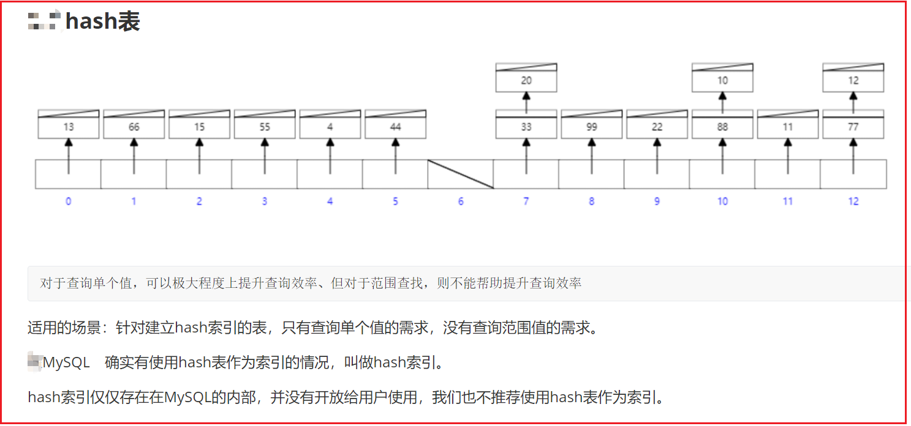
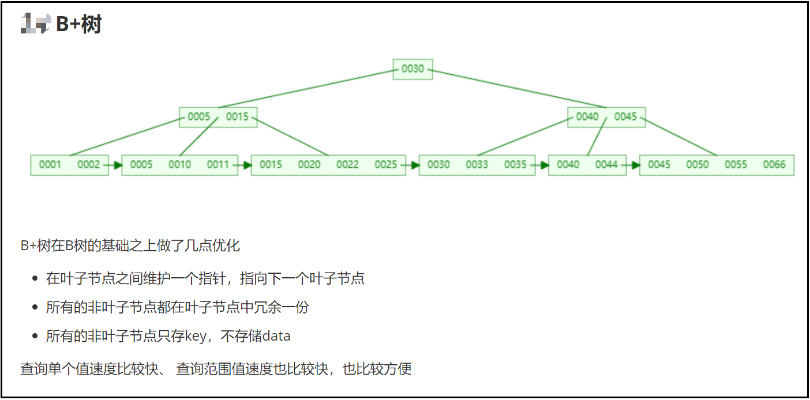
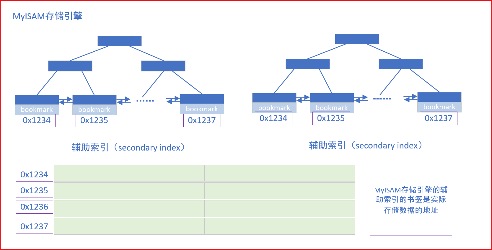

---

order: 10
title:  SQL调优

---


## SQL调优理论基础

### 索引数据结构

数据库索引是提高数据库查询性能的关键技术之一。索引类似于书籍的目录，通过索引可以快速定位到所需的数据，而不需要扫描整个表。

::: details 数据库索引的优缺点
#### 索引的优点
1. **提高查询速度**：通过索引，数据库引擎可以快速定位到所需的数据，而不需要扫描整个表。
2. **提高排序和分组效率**：索引可以加速排序和分组操作。
3. **唯一性约束**：唯一索引可以确保数据的唯一性，防止重复数据的插入。

#### 索引的缺点
1. **增加存储空间**：索引需要额外的存储空间，尤其是大型表和多列索引。
2. **降低写操作性能**：插入、更新和删除操作需要维护索引，增加了这些操作的开销。
3. **复杂性**：过多的索引会使数据库设计和维护变得复杂。
:::

为什么索引就更快呢? 这就要探究索引使用的数据结构了


::: info 常见的可作为索引的数据结构
#### 1. 数组和链表


#### 2. hash表



#### 3. 二叉树


- 可以适当的帮助我们提高查询单个值的效率
- 可以适当的帮助我们提高查询范围值的效率

二叉树（包括AVL树、红黑树）对于提升查询效率的帮助是十分有限的。为什么呢？

因为这些树只有两个“叉”，当数据变多的时候，树的层高会急剧上升，这就会导致搜索的困难增加，效率会明显降低。


#### 4. B树和B+树


<br/>



:::

- 在数据库中B+树的高度一般都在2～4层，也就是说查找某一行记录时最多只需要2到4次IO
- B+树索引的主要特点在于：
  - ==非叶子节点只存储关键字和子节点指针==：非叶子节点用于引导查找，存储关键字和指向子节点的指针，但不存储数据记录。
  - ==所有叶子节点包含关键字和数据指针==：在 B+树中，所有的数据记录都存储在叶子节点中，而非叶子节点只存储关键字和指向子节点的指针。
  - ==所有叶子节点通过指针链接在一起==：叶子节点之间通过指针链接，形成一个双向链表，便于范围查询。


### B+树索引

B+树（B+ Tree）是一种广泛应用于数据库和文件系统中的数据结构，特别适合于磁盘存储和检索大量数据。B+树的设计目标是减少磁盘 I/O 操作次数，从而提高数据检索的效率。B+树的特点：
1. **高度平衡**：B+树是高度平衡的树，所有叶子节点都在同一层，保证了查找、插入和删除操作的时间复杂度为 `O(log n)`。
2. **高效的空间利用率**：每个节点可以存储多个关键字和指针，减少了磁盘 I/O 操作次数。
3. **支持范围查询**：由于叶子节点通过指针链接在一起，B+树非常适合进行范围查询。
4. **数据集中存储**：所有数据记录都存储在叶子节点中，非叶子节点只用于引导查找，提高了查找效率。

::: info B+树的节点结构
1. **内部节点（非叶子节点）**：
   - 存储关键字和指向子节点的指针。
   - 关键字用于引导查找，指针指向子节点。
   - 每个内部节点最多有 M 个子节点，最少有  M/2 个子节点（其中M是节点的最大度数）。

2. **叶子节点**：
   - 存储关键字和数据记录（或数据记录的指针）。
   - 通过指针链接在一起，形成一个双向链表。
   - 每个叶子节点最多有 L个关键字，最少有 L/2个关键字（其中L是节点的最大容量）。
:::

::: details B+树的插入与删除
#### 插入操作

1. **查找插入位置**：从根节点开始，根据关键字递归查找插入位置，直到找到合适的叶子节点。
2. **插入关键字和数据**：在叶子节点中插入关键字和数据记录。
3. **分裂节点**：如果叶子节点已满，需要分裂节点，将一半的关键字和数据记录移到新节点中，并在父节点中插入新的关键字和指针。
4. **更新父节点**：如果父节点也满了，继续向上分裂，直到根节点或某个节点不再需要分裂。

#### 删除操作

1. **查找删除位置**：从根节点开始，根据关键字递归查找删除位置，直到找到合适的叶子节点。
2. **删除关键字和数据**：在叶子节点中删除关键字和数据记录。
3. **合并节点**：如果叶子节点中的关键字数量少于最小值，需要从兄弟节点借关键字或合并节点。
4. **更新父节点**：如果父节点中的关键字数量少于最小值，继续向上合并，直到根节点或某个节点不再需要合并。
:::


B+树索引可以分为聚集索引（clustered inex）和 非聚集索引（secondary index，辅助索引）
::: tip 聚集索引（clustered inex） 和 非聚集索引（secondary index）
聚集索引（Clustered Index）和非聚集索引（Secondary Index）是数据库中两种重要的索引类型，它们在数据存储和查询性能方面有着显著的区别。

#### 聚集索引（Clustered Index）

聚集索引（clustered index）就是按照每张表的主键构造一棵B+树，同时叶子节点中存放的即为整张表的行记录数据，也将聚集索引的叶子节点称为数据页。

- 数据页上存放的是完整的每行的记录，而在非数据页的索引页中，存放的仅仅是键值及指向数据页的偏移量，而不是一个完整的行记录。聚集索引的这个特性决定了索引组织表中数据也是索引的一部分。同B+树数据结构一样，每个数据页都通过一个双向链表来进行链接。

- 聚集索引的一个好处就是，它对于主键的排序查找和范围查找速度非常快。叶子节点的数据就是用户所要查询的数据。

- 由于实际的数据页只能按照一棵B+树进行排序，因此每张表只能拥有一个聚集索引。==主键通常用作聚集索引，因为主键是唯一的，适合按主键顺序存储数据==。

- 在多数情况下，查询优化器倾向于采用聚集索引。因为聚集索引能够在B+树索引的叶子节点上直接找到数据。此外，由于定义了数据的逻辑顺序，聚集索引能够特别快地访问针对范围值的查询。


#### 非聚集索引（Secondary Index）

辅助索引（Secondary Index），也称非聚集索引（non-clustered index）。其叶子节点并不包含行记录的全部数据。叶子节点除了包含键值以外，每个叶子节点中的索引行中还包含了一个书签（bookmark）

示例:
```sql
CREATE TABLE employees (
    employee_id INT PRIMARY KEY,      -- 聚集索引
    first_name VARCHAR(50),
    last_name VARCHAR(50),
    hire_date DATE,
    INDEX idx_last_name (last_name),  -- 非聚集索引
    INDEX idx_hire_date (hire_date)   -- 非聚集索引
);
```

**聚集索引 vs 非聚集索引**

| 特点                | 聚集索引（Clustered Index）            | 非聚集索引（Secondary Index）          |
|---------------------|---------------------------------------|--------------------------------------|
| **物理存储**        | 数据行按索引键顺序存储                 | 索引键和指向数据行的指针              |
| **数量限制**        | 一个表只能有一个聚集索引               | 一个表可以有多个非聚集索引             |
| **查询性能**        | 范围查询和排序查询性能高               | 需要额外的 I/O 操作，但灵活性高         |
| **插入和更新开销**  | 插入和更新可能导致数据行重新排序       | 插入和更新开销相对较小                 |
| **应用场景**        | 主键索引、范围查询、排序查询           | 多列查询、覆盖索引、辅助查询           |
:::

【注】许多数据库的文档会这样告诉读者：聚集索引按照顺序物理地存储数据。但是试想一下，如果聚集索引必须按照特定顺序存放物理记录，则维护成本显得非常之高。所以，聚集索引的存储并不是物理上连续的，而是逻辑上连续的。这其中有两点：

- 一是页通过双向链表链接，页按照主键的顺序排序；

- 另一点是每个页中的记录也是通过双向链表进行维护的，物理存储上可以同样不按照主键存储。

::: info B+树索引的应用场景
1. **数据库索引**：B+树广泛用于数据库的索引结构，如 MySQL 的 InnoDB 存储引擎。
2. **文件系统**：B+树用于文件系统的目录结构，如 NTFS 文件系统。
3. **搜索引擎**：B+树用于索引大量的文档和网页，支持高效的检索操作。
4. **内存数据库**：B+树也用于内存数据库中，如 Redis 的有序集合。
:::


### 回表/覆盖索引

**回表（Table Lookup）** 是指在使用非聚集索引（Secondary Index）进行查询时，数据库引擎需要先通过非聚集索引找到数据行的指针，然后再访问实际的数据行的过程(即需要再返回到主键索引树查询一次)。

::: tip 如何避免回表呢？
1. 尽量避免写 `select *` ，仅查询需要的字段，如果这些字段均包含在索引字段内且符合最左前缀原则，就可以不用回表了

2. 合理设计索引，可以考虑使用联合索引
:::

**联合索引**：针对多列值来构建B+树。（若查询的所有列是一个联合索引，则使用非聚集索引一次就可以查询到数据），也可以称这种方式为：==覆盖索引== （即将被查询的字段建立到联合索引中）


::: info 覆盖索引

最左前缀原则的一个重要应用是覆盖索引（Covering Index）。覆盖索引是指查询条件和返回结果都在索引列中，数据库引擎可以直接从索引中获取数据，而不需要访问实际的数据行。

示例: 假设有一个表 `orders`，并且在 `(customer_id, order_date, order_amount)` 上创建了一个组合索引：

```sql
CREATE TABLE orders (
    order_id INT PRIMARY KEY,
    customer_id INT,
    order_date DATE,
    order_amount DECIMAL(10, 2),
    INDEX idx_customer_order (customer_id, order_date, order_amount)
);
```

以下查询可以利用覆盖索引：

```sql
SELECT order_date, order_amount FROM orders WHERE customer_id = 123;
```

这个查询的条件 `customer_id` 是索引的最左列，返回的结果 `order_date` 和 `order_amount` 也在索引列中，因此可以利用覆盖索引，提高查询性能。
:::


### 最左前缀原则

最左前缀原则指的是在组合索引中，查询条件必须从索引的最左边的列开始匹配，才能有效利用索引。换句话说，查询条件中的列必须是索引列的前缀，这样才能利用索引进行快速查找。

::: tip 原理解释
组合索引是一个多列索引，索引的顺序决定了数据的存储顺序。数据库引擎在查找数据时，会按照索引列的顺序进行匹配。如果查询条件中的列不是索引列的前缀，那么数据库引擎无法利用索引进行快速查找，只能进行全表扫描。
:::

示例：假设有一个表 `employees`，并且在 `(last_name, first_name, hire_date)` 上创建了一个组合索引：

```sql
CREATE TABLE employees (
    employee_id INT PRIMARY KEY,
    last_name VARCHAR(50),
    first_name VARCHAR(50),
    hire_date DATE,
    INDEX idx_last_first_hire (last_name, first_name, hire_date)
);
```

**有效利用索引的查询**:

   ```sql
   -- 1. 完全匹配索引列 这个查询完全匹配了组合索引的所有列，可以充分利用索引。
   SELECT * FROM employees WHERE last_name = 'Smith' 
                           AND first_name = 'John' AND hire_date = '2020-01-01';

   -- 2. 部分匹配索引列  这个查询匹配了组合索引的前两列，也可以充分利用索引。
   SELECT * FROM employees WHERE last_name = 'Smith' AND first_name = 'John';

   -- 3. 仅匹配最左列（也可以充分利用索引）
   SELECT * FROM employees WHERE last_name = 'Smith';
   ```

**无法有效利用索引的查询**：

   ```sql
   -- 跳过最左列 这个查询跳过了组合索引的第一列 `last_name`，无法有效利用索引，会导致全表扫描。
   SELECT * FROM employees WHERE first_name = 'John' AND hire_date = '2020-01-01';
   ```

**总结**:
- **最左前缀原则**：查询条件必须从组合索引的最左边的列开始匹配，才能有效利用索引。
- **有效利用索引的查询**：完全匹配索引列、部分匹配索引列、仅匹配最左列。
- **无法有效利用索引的查询**：跳过最左列、仅匹配非最左列、不按顺序匹配。
- **覆盖索引**：查询条件和返回结果都在索引列中，可以提高查询性能。

通过合理设计组合索引和遵循最左前缀原则，可以显著提高数据库的查询性能。


### 数据库查询优化

- 对查询进行优化，要尽量避免全表扫描，首先应考虑在 where 及 order by 涉及的列上建立索引 

- 应避免在 where 子句中对字段进行 null 值判断，否则将导致引擎放弃使用索引而进行全表扫 描，

  如： select id from t where num is null 最好不要给数据库留NULL，尽可能的使用 NOT NULL填充数据库

  备注、描述、评论之类的可以设置为 NULL，其他的，最好不要使用NULL。 

- 应避免在 where 子句中使用 != 或 <> 操作符，否则引擎将放弃使用索引而进行全表扫描。 -

- 应避免在 where 子句中使用or来连接条件，如果一个字段有索引,一个字段没有索引，将导致引擎放弃使用索引而进行全表扫描

  ```SQL
  # 如：
  select id from t where num=10 or Name = 'admin'
  # 可以这样查询：
  select id from t where num = 10
  union all
  select id from t where Name = 'admin'
  ```

- in 和 not in 也要慎用，否则会导致全表扫描，如： 

  ```sql
  select id from t where num in(1,2,3) 
  ```

  对于连续的数值，能用 between 就不要用 in 了： 

  ```sql
  select id from t where num between 1 and 3 
  ```

  很多时候用 exists 代替 in 是一个好的选择


## MySQL数据库调优

### 索引及文件位置

MySQL默认使用主键列作为索引（若不设置主键、mysql会自动设置一个隐藏列作为索引）

::: tip 数据和索引的存储位置

对于mac系统默认在 `/usr/local/mysql` 文件夹中，对于win系统默认在：`c:/programdata/mysql` (隐藏文件夹). 

不在默认位置的情况下，一般是安装时初始化MySQL自定义了数据文件的存放位置，比如修改为安装目录的 data 目录下
:::


存储文件的详细说明：

- InnoDB存储引擎的表∶将索引和数据存放在同一个文件里。` *.ibd` 
- MyISAM存储引擎的表:索引和数据分开两个文件来存储。索引: ` *.MYI` ;  数据: `.MYD`  


```shell
使用InnoDB存储引擎的创建的表会生成两个文件：
	- 一个 `.frm` 结尾的表结构定义文件，
	- 一个存放数据和索引的 `.ibd` 文件 

而使用MyISAM存储引擎的创建的表会生成三个文件：
	- 一个 `.frm` 结尾的表结构定义文件，
	- 一个存放数据的 `.myd` 文件
	- 一个存放索引的 `.myi` 文件

```


### MySQL存储引擎

MySQL支持多种存储引擎。其中最常用的两种存储引擎是 InnoDB 和 MyISAM。

::: info MySQL存储引擎：InnoDB和MyISAM
#### InnoDB索引


#### MyISAM索引



:::

InnoDB和MyISAM有什么区别？什么情况下使用MyISAM？
::: tip InnoDB和MyISAM的区别
1. InnoDB 支持事务，MyISAM不支持事务，对于 InnoDB，每条SQL语句都自动封装成事务，自动提交，影响速度 

2. InnoDB 支持外键，MyISAM不支持外键 

3. InnoDB 的主键索引是聚集索引，数据文件和索引存储在一起。MyISAM则全是非聚集索引，索引和数据文件是分离的
   InnoDB 的存储文件是 frm 和 ibd，而MyISAM是 frm、myd、myi 三个文件。

4. InnoDB 不保存表的行数，`查询某张表的行数`时会全表扫描。MyISAM会保存整个表的行数，执行速度很快 

5. InnoDB 支持表锁和行锁（默认），而 MyISAM支持表锁。 
   行锁是指：锁的对象是一行数据、 表锁是指：锁的对象是一整张表
   行锁的效率比表锁的效率要高。锁的粒度越细，锁的效率越高。

6. InnoDB 表必须要有一个主键（如果用户不设置，那么引擎会自行设定一列[隐藏列]当做主键），MyISAM 则可以没有 


如何选择存储引擎？ 

- 是否需要事务？如果不需要（如历史记录数据），则可以使用MyISAM 。绝大多数操作是否是查询？如果是，可以选择MyISAM，

- 有读也有写，则选择 InnoDB
:::

MySQL如何指定存储引擎？

1. 创建表时指定存储引擎
```sql
CREATE TABLE employees (
    employee_id INT PRIMARY KEY,
    -- ...
) ENGINE = InnoDB;
```

2. 修改现有表的存储引擎
```sql
ALTER TABLE employees ENGINE = MyISAM;
```

3. 设置默认存储引擎
在 MySQL 的配置文件（通常是 my.cnf 或 my.ini）中设置默认的存储引擎
```bash
[mysqld]
default-storage-engine = InnoDB
```
也可以通过 SQL 语句设置默认存储引擎: `SET GLOBAL default_storage_engine = InnoDB;`

::: info 查看默认存储引擎
可以使用 SHOW VARIABLES 语句来查看当前的默认存储引擎
```sql
SHOW VARIABLES LIKE 'default_storage_engine';
```

可以使用 SHOW CREATE TABLE 语句来查看特定表的存储引擎
```bash
SHOW CREATE TABLE table_name;
```
:::


### 索引的分类和创建

- 主键索引: 主键自带索引效果，也就意味着通过主键来查询表中的记录，性能是非常好的

- 普通索引:为普通列创建的索引。创建索引的命令∶

  ```sql
  create index 索引名称 on 表名(列名) 
  create index idx_name on employees(name);
  ```

- 唯一索引∶ 就像是唯一列，列中的数据是唯一的。比普通索引的性能要好

  ```sql
  create unique index 索引名称 on 表名(列名)
  create unique index idx_unique_name on employees(name);
  ```

- 联合索引(组合索引)∶ 一次性为表中的多个字段一起创建索引(一个联合索引建议不要超过5个列)
  ```sql
  create index 索引名称 on 表(列1,列2,列3, ...)
  create index idx_name_age_position on employees(name, age, position);
  ```
  
- 全文索引：进行查询的时候，数据源可能来自于不同的字段或者不同的表。MyISAM存储引擎支持全文索引

  ```shell
  注意：在实际生产环境中，并不会使用MySQL提供的MyISAM存储引擎的全文索引功能来是实现全文查找。
  
  而是会使用第三方的搜索引擎中间件比如 `ElasticSearch`  (推荐) 、`Solr` 等。
  ```


::: info MySQL中创建/删除索引的方式
创建索引的三种方式：

```sql
-- 第一种方式：在执行create table时创建索引 
create table user_index(
    id int auto_increment primary key,    -- 主键索引
    first_name varchar(16),
    last_name varchar(16),
    id_card varchar(18),
    information text(225),

    key name(first_name,last_name),     -- 联合索引 （索引名为第一列的列名）
    unique key(id_card),                -- 唯一索引 （只有一列时索引名与列名一致）
    fulltext key(information)           -- 全文索引
    
    -- 还可以用如下方式：
    index index_first_name(first_name) using btree 
);

-- 第二种方式：使用Alter table命令去增加索引
alter table table_name add index  index_name(column_list);


-- 第三种方式：使用create index命令来创建
create index index_name on table_name(column_list);
```

删除索引可以通过 `DROP INDEX` 语句或 `alter table`来完成：
```bash
DROP INDEX index_name ON table_name;
alter table 表名  drop index 索引名


# 查看表的全部索引
show index from 表名;
```
:::


### 使用EXPLAIN

在 SQL语句 前面加上 `explain` 关键字，MySQL 就不会真正去执行这条语句，而是模拟优化器执行 SQL 查询语句，最后会输出一系列的指标告诉我们这条语句的性能如何。

```sql
EXPLAIN [EXTENDED] query;   -- `EXPLAIN`：显示查询的执行计划。 
                            -- `EXTENDED`：可选参数，显示更详细的执行计划信息。
```

::: info EXPLAIN 输出的字段及其含义

1. **id**：查询的标识符，表示查询的顺序。
    - ID 越大的组，其执行优先级越高。ID 相同的为一组，其执行优先级按照其顺序由上到下
    - 如果一个查询中有子查询，每个子查询会有一个独立的 id。

2. **select_type**：查询的类型，常见的值包括：
     - `SIMPLE`：简单查询，不包含子查询或 UNION。
     - `PRIMARY`：最外层的查询。最外层查询会被标记为主查询
     - `SUBQUERY`：子查询中的第一个 SELECT。
     - `DERIVED`：派生表中的第一个 SELECT（即在 FROM 子句中出现的子查询）。
     - `UNION`：UNION 中的第二个或后面的 SELECT。
     - `DEPENDENT UNION`：依赖于外部查询的 UNION 中的第二个或后面的 SELECT。
     - `UNCACHEABLE SUBQUERY`：不可缓存的子查询。

3. **table**：当前查询引用的表名。

4. **partitions**：匹配的分区（如果表被分区）。

5. **type**：访问类型，表示 MySQL 使用的连接类型，常见的值包括：
     - `system`：表只有一行记录，这是常量表。
     - `const`：表最多只有一个匹配行，读取常数次，通常用于主键或唯一索引。
     - `eq_ref`：唯一索引扫描，通常用于主键或唯一索引。
     - `ref`：非唯一索引扫描，返回所有匹配某个值的行。
     - `range`：索引范围扫描，例如 `BETWEEN`、`>` 等。
     - `index`：索引扫描。
     - `index_merge`: 索引合并,指对多个索引分别进行条件扫描,然后将它们各自的结果进行合并
     - `ALL`：全表扫描。
     - `null`： 表示 MySQL 能够在优化阶段分解查询语句，在执行阶段用不着再访问表或索引

6. **possible_keys**：可能使用的索引列表。

7. **key**：实际使用的索引。

8. **key_len**：使用索引的长度。长度越短，索引越有效。

9. **ref**：与索引比较的列或常量。

10. **rows**：根据表统计信息和索引选择情况，估算出的访问行数。

11. **filtered**： 表示通过索引过滤后的行数占总行数的百分比。

12. **Extra**：包含额外的信息，常见的值包括：
      - `Using where`：使用 WHERE 子句进行过滤。
      - `Using index`：使用覆盖索引，不需要回表。
      - `Using temporary`：使用临时表。
      - `Using filesort`：使用文件排序。
      - `Using join buffer`：使用连接缓冲区。
      - `Impossible WHERE`：WHERE 子句总是返回 FALSE，不会有任何结果。
      - `No tables used`：查询中没有表，例如 `SELECT 1`。
:::

通过 `EXPLAIN` 工具，可以深入了解查询的执行计划，从而优化查询性能。
更多更详细的信息参考：[EXPLAIN](https://dev.mysql.com/doc/refman/8.0/en/explain-output.html)


## 索引常见问题汇总 

### 使用自增主键

数据库为什么定义主键，并且在MySQL中使用推荐使用主键自增的策略？ 

```sql
为什么要自定义主键：

因为假如不自定义主键，那么在InnoDB中，也会维护一个隐藏的列来当做主键，这样就丢失了主键索引树的性能。


为什么要使用主键自增的策略呢？

因为在插入的过程中，需要经过 `分类、提取` (树的旋转) 等步骤，如果使用主键自增的策略，那么永远只会影响到索引树右边的结构，这样对整个B+树的结构影响是有限的，可以提高插入的效率

```


### 索引越多越好？

索引性能这么好，是不是一个表建立的索引越多越好？

```sql
不是。一个表中的索引建立多了会影响增删改的性能。

在企业中，对于单表来说，建立几个索引是合适的呢？不同的企业可能有不同的规范，一般默认不超过五个。即默认声明的索引列不超过五列。

```


```sql

1. innodb 默认页大小


2. 非聚集索引中、非唯一列的 key 只包含当前列信息吗？ 
根据 `show index from table_name;` 的查询结果来看确实如此，那这个索引列有多个重复值时，是如何存储的呢？
我原本的猜测是叶子结点存储了多个相关的主键信息

但有的书中有这样的描述：
    对于二级非唯一索引而言，因为只有索引列本身再加上主键列才能保证索引记录是唯一的，
    所以这二者合起来才能构成我们所说的“键”，而“值”就为空了，
    也就是说，二级非唯一索引中，在记录构成方面，非叶子节点只是比叶子节点多了一个PageNo指针信息。
    
也就是说 主键 + 这个索引列 一起构成了 索引树中的 key ？....


3. innodb中为什么要采用 聚集索引 ，这样导致回表时的性能消耗（虽然能通过联合索引避免回表、但这样做本身也需要权衡相关查询语句的使用频率和索引带来影响）和MyISAM中（单独存储数据）必然进行一次IO的消耗相比，差距大吗？

有相关解释是说MyISAM中的这种方式必然会进行一次IO, 是这样吗？

复杂点的情形下，当非聚集索引命中多条记录时：
	Innodb：可能导致回表，会根据主键进行多次聚集索引查询
	MyISAM: 多次的随机IO?

innodb这样的策略是在 `可能导致回表` 和 `必然进行IO 之中的选择吗？

```


