---

order: 20
title:  Servlet技术

---


官方文档：https://tomcat.apache.org/tomcat-8.5-doc/servletapi/

A servlet is a small Java program that runs within a Web server. 

Servlets receive and respond to requests from Web clients, usually across HTTP（the HyperText Transfer Protocol）

Servlet是运行在服务器里面的一个程序，可以对客户端的请求做出响应。Servlet主要是用来生成动态web资源的


## Servlet基础及应用

 Servlet（Server Applet）全称Java Servlet （ Java服务器端程序 ）、主要功能在于：交互式地浏览和修改数据，⽣成动态Web内容

- 狭义的Servlet是指Java语⾔实现的⼀个接⼝
- ⼴义的Servlet 是指任何实现了这个Servlet接⼝的类（⼀般情况下，⼈们将Servlet理解为后者）


tomcat10版本中，默认Servlet为5.0，官网对应信息：https://tomcat.apache.org/whichversion.html

::: tip 
**Apache Tomcat 10.0.x** builds on Tomcat 9.0.x and implements the **Servlet 5.0**, **JSP 3.0**, **EL 4.0**, **WebSocket 2.0** and **Authentication 2.0** specifications (the versions required by Jakarta EE 9 platform).

Servlet5.0起全类名不再是javax开头了，而是变成了Jakarta  ，在Tomcat10 + Servlet5.0 的环境下，一些依赖低版本servlet的库不能正常了，如Apache的 fileUpload
:::


### 创建Servlet项目

下面将介绍如何使用Java和一个简单的IDE（如Eclipse或IntelliJ IDEA）来创建和开发一个Servlet项目：

1. 环境准备：JDK + IDE（IntelliJ IDEA）+ Servlet容器（Apache Tomcat）

2. 创建项目：这里介绍几种创建方式如下：

- 将 javase 项目改造为 javaweb 项目

::: details JavaToJavaWeb
新建一个java普通项目，并在该项目根目录下新建一个 web 目录


<br/>

#### 1) WEB-INF 

将 web 目录设置为 资源目录：

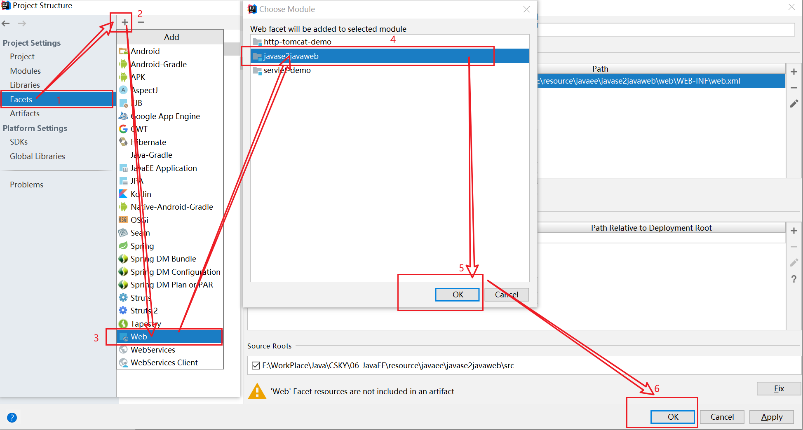

此时web目录下会新增 WEB-INF 目录，且WEB-INF 目录下有一个web.xml目录


#### 2) 项目配置修改

此时还需设置 Artifacts：

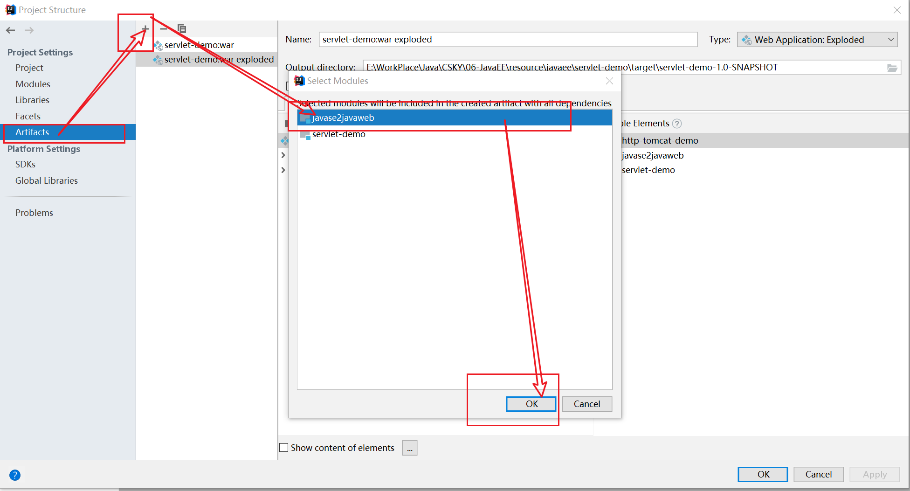


配置本地Tomcat服务器：

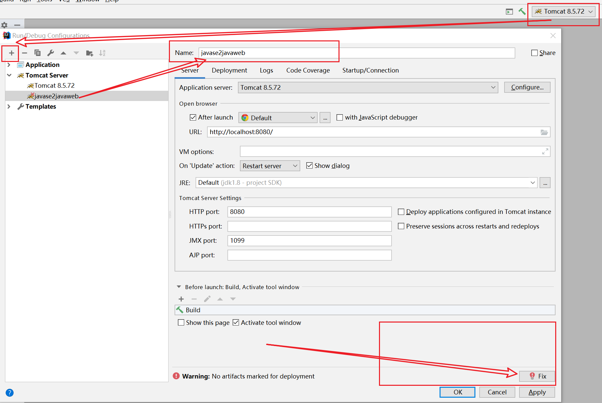


点击Fix，使用前面设置的 Artifacts ，再设置一下 Deployment ，如下：


#### 3) 访问静态资源

这时已经可以启动项目访问静态资源了，先在 web 目录下新建一个 index.html, 再启动项目


#### 4) Servlet设置

想要实现servlet 相关的功能，必须要是用其 jar包，由于是java普通项目，这里这能借助 Tomcat 下的库来使用

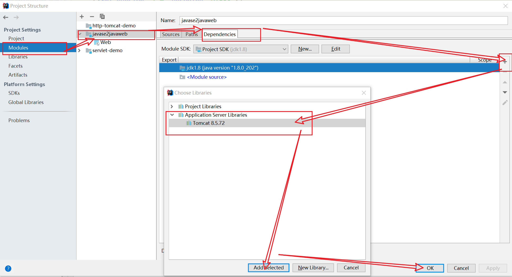


然后新建一个Servlet，如下：


重新部署项目，访问：http://localhost:8080/se2ee/hello


找不到jar包的异常：**JAVAEE项目中jar包必须得放置在build后的 应用根目录/WEB-INF/lib目录中**。 

:::


- 将一个普通maven项目改造为一个JavaWeb项目 
::: details MavenToJavaWeb

1. 新建一个maven项目、并在 src/main 下 新建webapp目录

2. 设置idea中的项目结构的Facets，注意要修改path，具体见图示

3. 在pom.xml文件中添加 war 打包方式

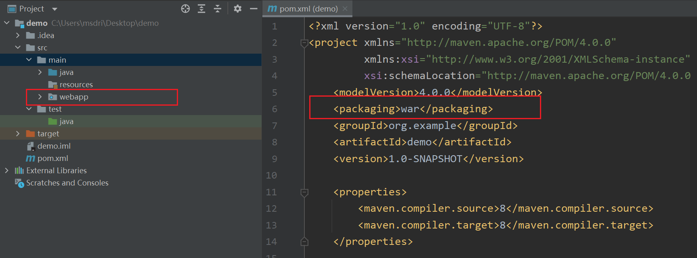

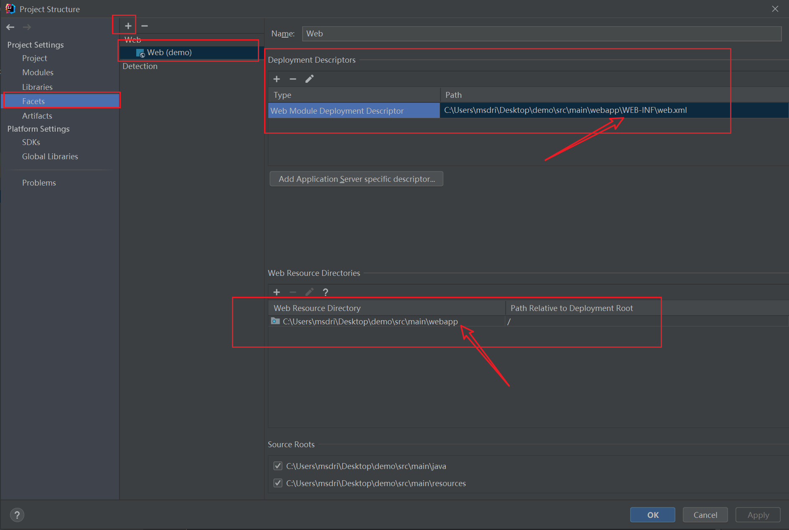

```xml

<!--最后导入相关依赖即可：
(provided: 这里是因为项目最后会打包到Tomcat中运行，会使用Tomcat中的servlet ) -->
<dependency>
    <groupId>javax.servlet</groupId>
    <artifactId>javax.servlet-api</artifactId>
    <version>3.1.0</version>
    <scope>provided</scope>
</dependency>

```
:::


- 使用IDEA直接创建JavaWeb项目

::: details 新建JavaWeb项目

IDEA2018创建JavaWeb项目：

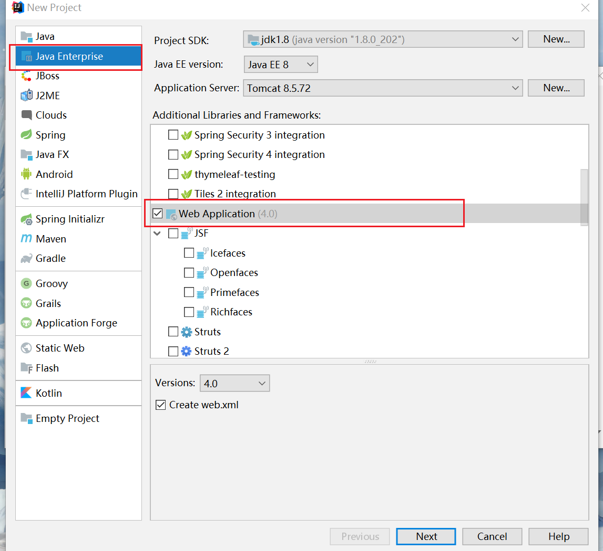

2018版IDEA创建的项目默认不支持maven，建议使用先创建Maven项目的方式，具体参照 MavenToJavaWeb


新版本IDEA中，可以一步到位：

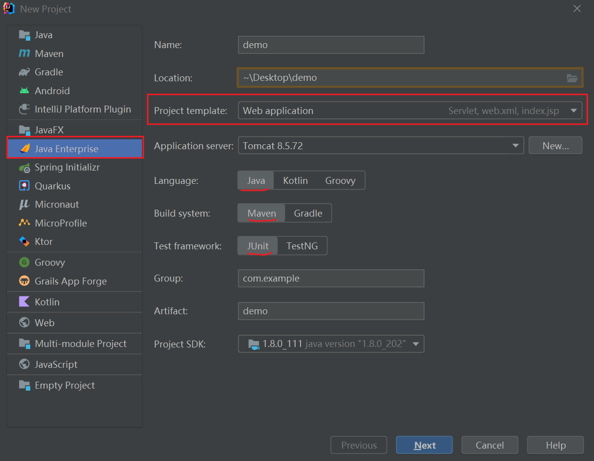

:::


3. 编写Servlet
- **创建Servlet类**：新建一个Java类，并继承`HttpServlet`。
- **覆盖`doGet()`和`doPost()`**：根据需求覆盖这两个方法。
  ```java
  import javax.servlet.ServletException;
  import javax.servlet.annotation.WebServlet;
  import javax.servlet.http.HttpServlet;
  import javax.servlet.http.HttpServletRequest;
  import javax.servlet.http.HttpServletResponse;
  import java.io.IOException;
  import java.io.PrintWriter;

  @WebServlet("/hello")
  public class HelloServlet extends HttpServlet {
      protected void doGet(HttpServletRequest request, HttpServletResponse response) throws ServletException, IOException {
          response.setContentType("text/html;charset=UTF-8");
          PrintWriter out = response.getWriter();
          try {
              out.println("<html><head><title>Hello Servlet</title></head>");
              out.println("<body><h1>Hello, World!</h1></body>");
              out.println("</html>");
          } finally {
              out.close();
          }
      }

      protected void doPost(HttpServletRequest request, HttpServletResponse response) throws ServletException, IOException {
          doGet(request, response);
      }
  }
  ```

4. 配置Servlet
- **编辑`web.xml`**：在`WEB-INF`目录下创建或编辑`web.xml`文件，配置Servlet。
  ```xml
  <?xml version="1.0" encoding="UTF-8"?>
  <web-app xmlns="http://xmlns.jcp.org/xml/ns/javaee"
           xmlns:xsi="http://www.w3.org/2001/XMLSchema-instance"
           xsi:schemaLocation="http://xmlns.jcp.org/xml/ns/javaee
           http://xmlns.jcp.org/xml/ns/javaee/web-app_4_0.xsd"
           version="4.0">

      <servlet>
          <servlet-name>HelloServlet</servlet-name>
          <servlet-class>HelloServlet</servlet-class>
      </servlet>

      <servlet-mapping>
          <servlet-name>HelloServlet</servlet-name>
          <url-pattern>/hello</url-pattern>
      </servlet-mapping>

  </web-app>
  ```

5. 部署和测试
- **打包项目**：使用IDE或Maven将项目打包为WAR文件。
- **启动Tomcat**：启动Tomcat服务器。
- **部署WAR文件**：将WAR文件部署到Tomcat的`webapps`目录下。
- **测试Servlet**：通过浏览器访问`http://localhost:8080/YourAppName/hello`来测试Servlet。


### web.xml文件

`web.xml`文件是Java Web应用中非常重要的配置文件，它用于定义应用的各种配置信息，包括Servlet的配置、过滤器、监听器等。

`web.xml`文件是一个XML文件，它位于Web应用的`WEB-INF`目录下。`web.xml`文件的根元素是`<web-app>`，并且必须遵循一个特定的DTD（Document Type Definition）或XSD（XML Schema Definition）。

- **DTD/XSD声明**：指定使用的DTD或XSD版本。
- **`<display-name>`**：指定应用的显示名称。
- **`<description>`**：描述应用的简短说明。
- **`<context-param>`**：配置全局的初始化参数。
- **`<filter>`**：配置过滤器。
- **`<listener>`**：配置监听器。
- **`<servlet>`**：配置Servlet。
- **`<servlet-mapping>`**：配置Servlet的映射。
- **`<welcome-file-list>`**：配置欢迎文件列表。
- **`<error-page>`**：配置错误页面。

下面是一个简单的`web.xml`文件示例，展示了如何配置一个Servlet：
```xml
<?xml version="1.0" encoding="UTF-8"?>
<web-app xmlns="http://xmlns.jcp.org/xml/ns/javaee"
         xmlns:xsi="http://www.w3.org/2001/XMLSchema-instance"
         xsi:schemaLocation="http://xmlns.jcp.org/xml/ns/javaee
         http://xmlns.jcp.org/xml/ns/javaee/web-app_4_0.xsd"
         version="4.0">

    <!-- 应用的显示名称 -->
    <display-name>My Web Application</display-name>

    <!-- Servlet的配置 -->
    <servlet>
        <servlet-name>HelloServlet</servlet-name>
        <servlet-class>com.example.HelloServlet</servlet-class>
        <load-on-startup>1</load-on-startup>
    </servlet>

    <!-- Servlet的映射 -->
    <servlet-mapping>
        <servlet-name>HelloServlet</servlet-name>
        <url-pattern>/hello</url-pattern>
    </servlet-mapping>

    <!-- 全局初始化参数 -->
    <context-param>
        <param-name>appVersion</param-name>
        <param-value>1.0</param-value>
    </context-param>

    <!-- 过滤器配置 -->
    <filter>
        <filter-name>LoggingFilter</filter-name>
        <filter-class>com.example.LoggingFilter</filter-class>
    </filter>

    <!-- 过滤器映射 -->
    <filter-mapping>
        <filter-name>LoggingFilter</filter-name>
        <url-pattern>/*</url-pattern>
    </filter-mapping>

    <!-- 监听器配置 -->
    <listener>
        <listener-class>com.example.MyServletContextListener</listener-class>
    </listener>

    <!-- 欢迎文件列表 -->
    <welcome-file-list>
        <welcome-file>index.jsp</welcome-file>
    </welcome-file-list>

    <!-- 错误页面 -->
    <error-page>
        <error-code>404</error-code>
        <location>/error/404.jsp</location>
    </error-page>

</web-app>
```


### Servlet注解开发

Servlet3.0的出现是servlet史上最大的变革，其中的许多新特性大大的简化了web应用的开发

Servlet3.0提供的注解(annotation)，使得不再需要在web.xml文件中进行Servlet的部署描述，简化开发流程

注解配置：` @WebServlet`   常⽤属性如下：

| @WebServlet注解属性 | 类型           | 说明                                                         |
| ------------------- | -------------- | ------------------------------------------------------------ |
| asyncSupported      | boolean        | 指定Servlet是否⽀持异步操作模式                              |
| displayName         | String         | 指定Servlet显示名称                                          |
| initParams          | webInitParam[] | 配置初始化参数                                               |
| loadOnStartup       | int            | 标记容器是否在应⽤启动时就加载这个 Servlet，等价于配置⽂件中的标签 |
| name                | String         | 指定Servlet名称                                              |
| urlPatterns/value   | String[]       | 这两个属性作⽤相同，指定Servlet处理的url                     |

- `loadOnStartup`属性：

  标记容器是否在启动应⽤时就加载Servlet、默认不配置或数值为负数时表示客户端第⼀次请求Servlet时再加载；

  0或正数表示启动应⽤就加载，正数情况下，数值越⼩，加载该 Servlet的优先级越⾼

- `name`属性：

  可以指定也可以不指定，通过getServletName()可以获取到，若不指定，则为Servlet的 完整类名

  如：`cn.edu.UserServlet ` 

- `urlPatterns/value` 属性： String[]类型，可以配置多个映射、如：`urlPatterns={"/user/test", "/user/example"}` 

<br/>

```java

@WebServlet(name = "myUserServlet", urlPatterns = "/user/test",    // 必须有斜杠
 			loadOnStartup = 1, 
			initParams = {
                 @WebInitParam(name="name", value="zhangsan"),
                 @WebInitParam(name="pwd", value="123456")
             }
)
public class UserServlet extends HttpServlet {
    // ......
}


// 通常只需要设置访问路径即可
@WebServlet("/user/test")
public class UserServlet extends HttpServlet {
    // ......
}

```


### Servlet生命周期

This interface defines methods to initialize a servlet, to service requests, and to remove a servlet from the server. These are known as life-cycle methods and are called in the following sequence:

1. The servlet is constructed, then initialized with the `init` method.
2. **Any calls from clients to the `service` method are handled.**
3. The servlet is taken out of service, then destroyed with the `destroy` method, then garbage collected and finalized.


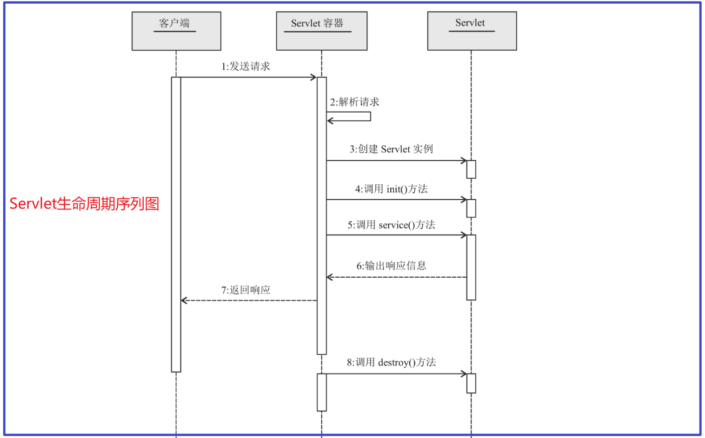

<br/>

```java

@WebServlet("/hello")
public class HelloServlet extends HttpServlet {

    // init默认情况下会在当前servlet第一次被调用之前调用
    @Override
    public void init() throws ServletException {
        super.init();
    }

    @Override
    protected void doGet(HttpServletRequest req, HttpServletResponse resp) 
        throws ServletException, IOException {
        resp.getWriter().println("hello");
    }

    // 当前应用被卸载、服务器被关闭 时调用
    @Override
    public void destroy() {
        super.destroy();
    }
}

```

init、destroy方法有什么意义？

这两个方法分别会在当前servlet被创建以及被销毁的时候调用，

如果你的某个业务逻辑恰好也需要在该时间点去做一些操作，那么就可以把你的代码逻辑写在该方法中。

<br>

使用场景：统计每个servlet处理请求的次数，统计哪个servlet的访问量最高

方式一：每当用户访问一次，那么我将本地访问操作写入数据库，最终统计数据库里面某个地址出现的次数（频繁交互）

方式二：在servlet中定义一个成员变量，每当用户访问一次，变量值+1，destroy方法中将次数以及对应的地址写入数据库，重新上线之后，init方法中重新去读取数据库里面的值 

<br>

关于init方法，还有一个补充，默认情况下，是在**客户端第一次访问当前servlet之前被调用**，也可以设置一个参数`load-on-startup=非负数` ，servlet的init方法就会随着应用的启动而被调用

```java
// 注解方式
@WebServlet(value = "/login",loadOnStartup = 1)

```

```xml
<!-- xml配置文件 -->
<servlet>
    <servlet-name>first</servlet-name>
    <servlet-class>com.xxxx.servlet.FirstServlet</servlet-class>
    <load-on-startup>1</load-on-startup>
</servlet>

```


<br>


### url-pattern详解

1、一个servlet可不可以设置多个url-pattern？ 可以

```java

@WebServlet(value = {"/hello","/helloServlet"},loadOnStartup = 1)

```

<br/>

2、多个servlet可不可以映射到同一个url-pattern？ 不可以

```java

/* 会抛出异常
Caused by: java.lang.IllegalArgumentException: 
The servlets named [com.xxxxx.servlet.servlet.HelloServlet] and 			 
                   [com.xxxxx.servlet.servlet.HelloServlet2] 
are both mapped to the url-pattern [/hello] which is not permitted

```

<br/>

3、url-pattern 的合法写法有哪些呢？

```java
/*
url-pattern的合法写法只有两种:

	/xxxxx    如 /user/login 、 /user/* 、 /* 、 /(DefaultServlet，下面会详细介绍) 等等
	
	*.xxxx    如 *.html	
	
常见错误写法：比如直接写 servletTest ( 没加 `/` )、  /hello*.do （ 中间加通配符 ）、 /user/*.do
    
Caused by: java.lang.IllegalArgumentException: Invalid <url-pattern> [servletTest] in servlet mapping

```


<br/>


任何一个请求，最终都只会交给一个servlet来处理，如果使用了通配符、有多个servlet都可以处理该请求，那么需要去选出一个优先级最高的来处理
::: info 优先级问题
```java
/*
1. /xxxx  优先级要高于  .xxxx    但 /(DefaultServlet，下面会详细介绍) 例外

2. 如果都是/xxxxx, 那么匹配程度越高，优先级越高 

	/user/login (精确匹配)  > /user/*  >  /*
	
总结： 精确路径 > 最长路径 > 后缀匹配 
```

示例 （ 特殊的 `/*` ）：


值得注意的是 jsp 文件实际也是一个 servlet，Tomcat中有一个统一处理 jsp 的 Servlet

```xml
 <!--Tomcat的 conf\web.xml 文件 -->
<servlet>
    <servlet-name>jsp</servlet-name>
    <servlet-class>org.apache.jasper.servlet.JspServlet</servlet-class>
    <init-param>
        <param-name>fork</param-name>
        <param-value>false</param-value>
    </init-param>
    <init-param>
        <param-name>xpoweredBy</param-name>
        <param-value>false</param-value>
    </init-param>
    <load-on-startup>3</load-on-startup>
</servlet>

<!-- The mappings for the JSP servlet -->
<servlet-mapping>
    <servlet-name>jsp</servlet-name>
    <url-pattern>*.jsp</url-pattern>
    <url-pattern>*.jspx</url-pattern>
</servlet-mapping>

```

但是由于 `/*` 的优先级大于 `*.jsp`，显然这里两个以jsp结尾的请求只能由我们自定义的 myServlet 来处理
:::


在上例的基础上，我们继续增加了一个 login.html 文件、和一个 MyDefaultServlet 

::: info 缺省Servlet
先看看这两个请求（毫无疑问，由于 /* 的优先级在这儿最高，结果跟上面一样）


<br/>

现在 注释掉 `/*` ，再看看结果：

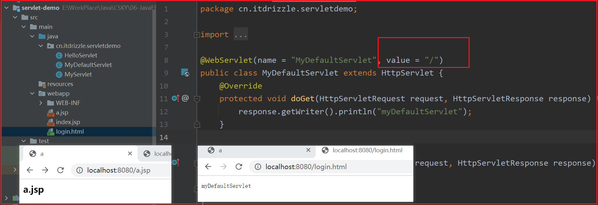

a.jsp 匹配了 Tomcat 提供的 `*jsp` （如果非要比较  `*.jsp` 和 `/` 的优先级，想必结果已经不言而喻了）

```xml
<!-- 上面的请求即使我们不写 a.jsp， Tomcat的 conf/web.xml中也定义了默认的页面，所以并不会去匹配 我们定义的 / -->
<welcome-file-list>
    <welcome-file>index.html</welcome-file>
    <welcome-file>index.htm</welcome-file>
    <welcome-file>index.jsp</welcome-file>
</welcome-file-list>

```

<br>

可以得出如下结论：`/` 处理的是那些没有任何servlet可以处理的请求（一般为静态资源），故 `/` 又称为DefaultServlet（缺省Servlet）

其实、如果我们不定义缺省的Servlet，Tomcat已经定义了一个，如下：

```xml
 <!--Tomcat的 conf\web.xml 文件 -->
<servlet>
    <servlet-name>default</servlet-name>
    <servlet-class>org.apache.catalina.servlets.DefaultServlet</servlet-class>
    <init-param>
        <param-name>debug</param-name>
        <param-value>0</param-value>
    </init-param>
    <init-param>
        <param-name>listings</param-name>
        <param-value>false</param-value>
    </init-param>
    <load-on-startup>1</load-on-startup>
</servlet>

<servlet-mapping>
    <servlet-name>default</servlet-name>
    <url-pattern>/</url-pattern>
</servlet-mapping>

```

DefaultServlet 会去寻找对应的静态资源，若存在则返回对应静态资源，否则返回404

参照下图：

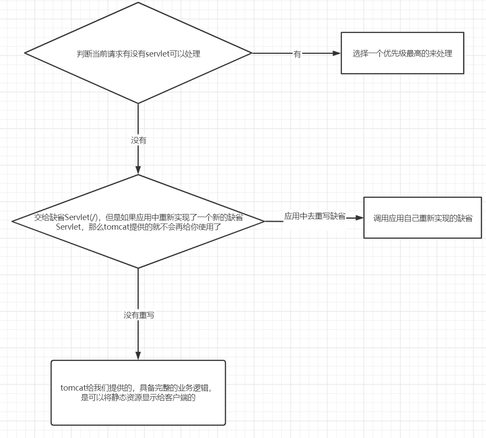
:::


### Servlet执行流程

从浏览器发起请求到Servlet执行完成并返回响应的整个过程如下：

::: tip Servlet执行流程
#### 1. 浏览器发起请求
- **域名解析**：浏览器首先解析域名到IP地址。
- **TCP连接建立**：浏览器通过TCP三次握手建立到服务器的连接。
- **发送HTTP请求**：浏览器构造HTTP请求并发送到服务器。

#### 2. 请求到达服务器主机
- 请求到达服务器，被监听80端口号的服务器程序（通常是Servlet容器如Apache Tomcat）接收到。
- **Connector组件**：请求被Connector组件接收到，Connector组件负责网络I/O操作，包括读取请求报文、解析HTTP请求，并创建`HttpServletRequest`和`HttpServletResponse`对象。

#### 3. Connector传递给Container
- Connector将`HttpServletRequest`和`HttpServletResponse`对象传递给容器（Container）组件。
- **Engine组件**：Engine是容器组件的一种，代表整个Servlet容器，它会进一步将请求传递给虚拟主机（Host）组件。

#### 4. Host组件处理
- **Host组件**：每个虚拟主机对应不同的域名或者端口，Host组件根据请求的域名选择合适的虚拟主机。
- 如果找到匹配的虚拟主机，则请求会被传递给该虚拟主机对应的上下文（Context）组件；如果没有找到匹配的虚拟主机，则默认由ROOT应用处理。

#### 5. Context组件处理
- **Context组件**：每个Context代表一个Web应用程序，Context组件会根据请求的URL找到合适的Servlet或静态资源。
- 如果找到匹配的Servlet，则请求会被传递给该Servlet；如果没有找到匹配的Servlet，则可能会交给DefaultServlet来处理，通常用于返回静态资源或返回404错误页面。

#### 6. Servlet处理请求
- **Servlet实例化与初始化**：如果Servlet还没有被实例化，则Servlet容器会先实例化并初始化Servlet。
- **Service方法**：Servlet容器通过反射机制调用Servlet的`service()`方法，将`HttpServletRequest`和`HttpServletResponse`对象作为参数传递给Servlet。
- 在`service()`方法内部，Servlet根据请求类型（GET、POST等）调用对应的`doGet()`或`doPost()`等方法处理请求。

#### 7. 返回响应
- **生成响应**：Servlet在处理完请求之后，通过`HttpServletResponse`对象设置响应的状态码、响应头和响应体。
- **Connector发送响应**：Connector组件根据`HttpServletResponse`中的数据生成HTTP响应报文，并通过已建立的TCP连接将响应发送回客户端。

#### 8. 客户端接收响应
- **浏览器接收响应**：浏览器接收到响应后，根据响应内容进行渲染或执行其他操作。

整个流程从浏览器发起请求开始，经过DNS解析、TCP连接建立、HTTP请求发送，然后请求被服务器端的Connector接收，经过Engine、Host、Context等组件传递到具体的Servlet进行处理，最后由Connector组件生成HTTP响应报文并发送回客户端。
:::

`Connector`是Tomcat中的一个组件，负责处理与客户端（例如浏览器）的网络通信。它接收来自客户端的HTTP请求，解析这些请求，并将它们转换成容器可以理解的对象形式（如`HttpServletRequest`和`HttpServletResponse`）。此外，它还负责将容器产生的响应转换为HTTP响应报文，再发送回客户端。
- 在Tomcat中，Connector通常配置为监听特定的端口（如80或443），并且支持不同的协议（如HTTP/1.1, HTTPS）。

::: info Container (容器)
Container是一个抽象的概念，在Tomcat中有多个级别的容器实现，如Engine、Host、Context等。这些容器负责处理请求，从最高层的Engine到最底层的Context。容器可以包含子容器，形成树状结构。层级如下：
  - **Engine**：代表整个Servlet容器，它包含多个虚拟主机（Hosts）。
  - **Host**：代表虚拟主机，它可以处理多个不同的域名。每个Host可以有多个Context。
  - **Context**：代表一个Web应用程序，它包含了Servlet和其他Web资源。

#### Host (虚拟主机)
- **功能**：Host组件代表了一个虚拟主机，能够处理针对不同域名的请求。在一个物理服务器上，可以通过配置多个Host来模拟多个独立的网站或应用。
- **示例**：如果你有一个单一的物理服务器，但想要运行多个网站（比如example.com和example.org），你可以为每个域名配置一个Host。

#### Context (上下文)
- **功能**：Context是最低级别的容器，它代表了一个Web应用程序。每个Context都包含了一组Servlet和其他Web资源，比如JSP文件、HTML文件等。Context负责管理Web应用程序的生命周期，并且处理针对该应用程序的具体请求。
- **示例**：每个部署在Tomcat上的Web应用程序都会有一个对应的Context，例如一个名为`myapp`的应用程序会有其自身的Context。
:::

这些组件共同协作，使得Tomcat能够处理HTTP请求并将其路由到正确的Servlet或资源。当一个HTTP请求到达Tomcat时，Connector接收请求，然后根据请求的路径信息将请求传递给相应的Container层级，最终到达Context，由Context决定具体哪个Servlet或资源来处理这个请求。


### Servlet上下文

在Servlet中，`ServletRequest`、`ServletResponse`、`ServletConfig`和`ServletContext`是非常重要的对象，它们在处理HTTP请求和响应的过程中发挥着关键作用。


ServletConfig接口提供了Servlet的配置信息，它是在Servlet初始化时由Servlet容器传递给Servlet的。

::: info ServletConfig

可以通过该对象来获取一些servlet的**初始化参数**。

```xml

<!--xml中的初始化参数-->
<servlet>
    <servlet-name>default</servlet-name>
    <servlet-class>org.apache.catalina.servlets.DefaultServlet</servlet-class>
    <init-param>
        <param-name>debug</param-name>
        <param-value>0</param-value>
    </init-param>
    <init-param>
        <param-name>listings</param-name>
        <param-value>false</param-value>
    </init-param>
    <load-on-startup>1</load-on-startup>
</servlet>

```

<br/>

| ServletConfig接口方法                         | 说明                                      |
| --------------------------------------------- | ----------------------------------------- |
| `public String getInitParameter(String name)` | 返回名字为name的初始化参数的值            |
| `public Enumeration getInitParameterNames()`  | 返回Servlet所有初始化参数的名字的枚举集合 |
| `public ServletContext getServletContext()`   | 返回Servlet上下文对象的引用               |
| `public String getServletName()`              | 返回Servlet实例的名字                     |

<br>

```java

public class ConfigServlet extends GenericServlet {
    @Override
    public void service(ServletRequest servletRequest, ServletResponse servletResponse) 
        throws ServletException, IOException {
        
        //在程序运行时可以获取到该servlet初始化参数 init-param
        // 1. 拿到ServletConfig对象
        ServletConfig servletConfig = getServletConfig();
        
        // 2. 获取初始化的参数和值 （初始化参数可以在web.xml配置文件或注解中进行配置）
        String name = servletConfig.getInitParameter("name");
        System.out.println(name);
    }
}

```

关于ServletConfig：了解即可 (如果看到别人的代码这么写，知道什么意思即可)
:::


ServletContext接口表示Servlet容器中的Web应用程序上下文。它是整个Web应用程序的全局信息存储点，可以在Web应用程序的所有Servlet之间共享数据。
::: info ServletContext
获取ServletContext对象的方法：
- 通过ServletConfig对象的 `getServletContext()` 方法来得到ServletContext对象
- 通过GenericServlet类的 `getServletContext()` 方法得到ServletContext对象

GenericServlet类的getServletContext（）也是调用ServletConfig对象的getServletContext（）方法来得到这个对象的。

```java
// Servlet 获取ServletContext对象
protected void doPost(HttpServletRequest req, HttpServletResponse resp) 
    throws ServletException, IOException {
    // 方法一：通过GenericServlet提供的 getServletContext()
    ServletContext servletContext1 = getServletContext();
    
    // 方法二：通过ServletConfig提供的getServletContext()
    ServletContext servletContext2 = getServletConfig().getServletContext();
    
    // 方法三：通过HttpServletRequest获取
    ServletContext servletContext3 = req.getServletContext();
    
    // 方法四：通过HttpSession获取
    ServletContext servletContext = req.getSession().getServletContext();
} 

```

ServletContext属性属于共享属性（任何一个Servlet都可以设置、读取某个属性）， 读取、移除和设置共享属性的方法：

- `public Object getAttribute(String name) ` ：读取名为name的属性
- `public Enumeration getAttributeNames()` ：
- `public void removeAttribute(String name)` ：删除名为name的属性
- `public void setAttribute(String name, Object object)` ：设置共享属性

| ServletContext接口常用方法                                   | 说明                          |
| ------------------------------------------------------------ | ----------------------------- |
| `public String getInitParameter(String name)`                | 获取初始化参数                |
| `public RequestDispatcher getRequestDispatcher(String path)` | 返回一个RequestDispatcher对象 |
| `　public RequestDispatcher getNamedDispatcher(String name)` | 同上、但参数为 servlet-name   |


**Servlet下文件的路径问题**：

```java

public class PathServlet extends HttpServlet {

    protected void doGet(HttpServletRequest request, HttpServletResponse response) 
        throws ServletException, IOException {
        
        // 普通java项目的相对路径是用户的工作目录： src 下
        // web项目（ee项目）的本质其实就是写了一些代码片段来供服务器调用
        // 故在servlet中通过下面的方式获取路径，得到的是Tomcat的 bin 目录
        File file = new File("1.txt");               
        System.out.println(file.getAbsolutePath());  // D:\apache-tomcat-8.5.37\bin\1.txt
        
        
        // 如何获取应用路径 docBase ---- 利用ServletContext可以获取应用的docBase
        // 我们通过虚拟映射等配置应用的应用名、docBase，这些配置项是会被tomcat读取的
        // 所以tomcat肯定可以知道某个应用的应用路径
        // tomcat给开发者提供了一个获取应用路径的方式，那就是利用servletrContext来获取
        ServletContext servletContext = getServletContext();
        
        //方式一：输入空字符串，返回docBase
        String realPath = servletContext.getRealPath("");
        System.out.println(realPath);
        
        //方式二：里面输入一个相对应用根目录的相对路径，可以返回文件的绝对路径
        String realPath1 = servletContext.getRealPath("1.txt");
        System.out.println(realPath1);
    }
}

```
:::


ServletRequest接口表示客户端发送给服务器的请求。它是Servlet容器传递给Servlet的请求对象，包含了关于HTTP请求的所有信息。

::: info ServletRequest

| ServletRequest接口常用方法                                   | 说明                                                  |
| ------------------------------------------------------------ | ----------------------------------------------------- |
| `String getParameter(String name)`                           | 以字符串形式返回请求参数的值                          |
| `public String[] getParameterValues(String name)`            | 返回请求中name参数所有的值                            |
| `public void setAttribute(String name,Object o)`             | 保存名字为name的属性                                  |
| `public void removeAttribute(String name)`                   | 移除请求中名字为name的属性                            |
| `public void setCharacterEncoding(String env)`               | 设置字符编码（解决post提交方式的乱码）                |
| `public RequestDispatcher getRequestDispatcher(String path)` | 返回RequestDispatcher对象，作为path所定位的资源的封装 |

**HttpServletRequest**接口是ServletRequest接口的子接口，主要用于提供HTTP请求信息的功能

| HttpServletRequest接口常用方法              | 说明                                                         |
| ------------------------------------------- | ------------------------------------------------------------ |
| `public Cookie[] getCookies()`              | 返回客户端在此次请求中发送的所有Cookie对象                   |
| `public voidaddCookie(Cookie cookie) `      | 添加一个Cookie到响应中                                       |
| `public HttpSession getSession()`           | 返回和此次请求相关联的Session，如果没有给客户端分配Session，<br />则创建一个新的Session |
| `public void sendRedirect(String location)` | 发送一个临时的重定向响应到客户端，让客户端访问新的URL        |


```java

// ServletRequest 使用示例
@WebServlet("/hello")
public class HelloServlet extends HttpServlet {

    @Override
    protected void doGet(HttpServletRequest req, HttpServletResponse resp) 
        throws ServletException, IOException {

        StringBuilder result = new StringBuilder();
        
        // 请求行信息
        result.append("Method: ").append(req.getMethod()).append("\r\n");
        result.append("RequestURI: ").append(req.getRequestURI()).append("\r\n");
        result.append("RequestURL: ").append(req.getRequestURL()).append("\r\n");
        result.append("Protocol: ").append(req.getProtocol()).append("\r\n\r\n");

        // 请求头信息
        Enumeration<String> headerNames = req.getHeaderNames();
        while (headerNames.hasMoreElements()){
            StringBuilder headerLine = new StringBuilder();

            String headerName = headerNames.nextElement();
            headerLine.append(headerName).append(": ").append(req.getHeader(headerName));

            result.append(headerLine).append("\r\n");
        }

        // 用户信息
        String remoteUser = req.getRemoteUser();
        String remoteAddr = req.getRemoteAddr();
        String remoteHost = req.getRemoteHost();
        int remotePort = req.getRemotePort();

        result.append("\r\n").append("User: ").append(remoteUser).append("\r\n");
        result.append("User Addr: ").append(remoteAddr).append("\r\n");
        result.append("User Host: ").append(remoteHost).append("\r\n");
        result.append("User Port: ").append(remotePort).append("\r\n\r\n");

        // 服务器信息
        String localAddr = req.getLocalAddr();
        String localName = req.getLocalName();
        int localPort = req.getLocalPort();
        result.append("Server Addr: ").append(localAddr).append("\r\n");
        result.append("Server Name: ").append(localName).append("\r\n");
        result.append("Server Port: ").append(localPort).append("\r\n\r\n");


        // 获取表单请求参数
        Enumeration<String> parameterNames = req.getParameterNames();
        while(parameterNames.hasMoreElements()){
            String paraName = parameterNames.nextElement();
            String parameter = req.getParameter(paraName);

            result.append("Parameter-").append(paraName).append(": ").append(parameter).append("\r\n");
        }


        // 将信息保存到 应用根目录下的 request.txt
        ServletContext servletContext = getServletContext();

        // InputStream inputStream = servletContext.getResourceAsStream("request.txt");

        String path = servletContext.getRealPath("request.txt");
        // FileWriter writer = new FileWriter(path);
        // writer.write(String.valueOf(result));
        FileOutputStream fileOutputStream = new FileOutputStream(path);
        fileOutputStream.write(String.valueOf(result).getBytes());
        fileOutputStream.close();
        
        
        // 获取请求体:一般情况下，不需要我们主动去获取请求体，即便浏览器以post请求方式提交请求参数
        // tomcat也会帮我们把请求参数解析好，所以一般情况下是不需要开发者自己主动去获取请求体的
        // 只有在进行文件上传时，才需要我们去操作请求体
//        request.getInputStream();
        
        // 而且值得注意的是，当我们先使用 getInputStream 获取了请求体，
        // 再调用 getParameter 等方法时，无法再获取到参数 （......）
        

        // 将信息响应给客户端
        resp.getWriter().println(result);
    }

    @Override
    protected void doPost(HttpServletRequest req, HttpServletResponse resp) 
        throws ServletException, IOException {
        this.doGet(req, resp);
    }

}

```

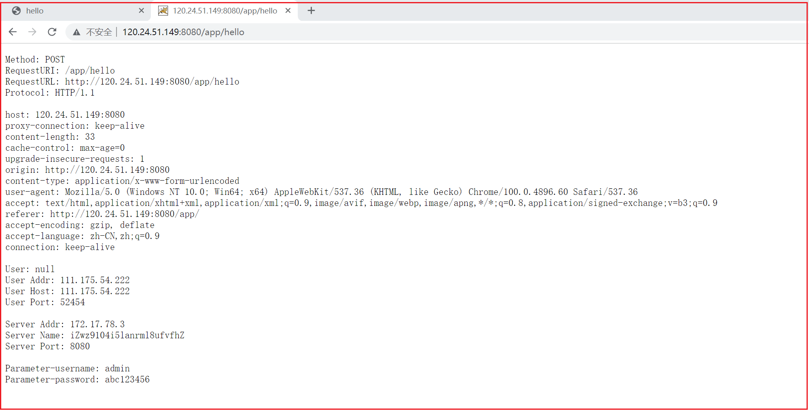

```

ServletContext对象内部有一个map ( 即 Context域 )：
	只要组件可以拿到同一个ServletContext对象的引用，那么就可以共享该内存空间。
	context域空间比较大，因为ServletContext对象生命周期非常久。
	一个应用下的任意web资源都可以拿到同一个servletContext对象引用。


request对象中也有一个map（Request域）：哪些组件可以共享request对象？
	只有转发的两个组件之间才可以共享
	注意在浏览器地址栏输入一个地址，刷新多次，那么服务器解析处理时生成的是多个request对象

```
:::


ServletResponse接口表示服务器返回给客户端的响应。它是Servlet容器传递给Servlet的响应对象，用于构造HTTP响应。

::: info ServletResponse

**ServletResponse**接口用于定义一个对象来帮助Servlet向客户端发送响应 

| ServletResponse接口常用方法                        | 说明                                                    |
| -------------------------------------------------- | ------------------------------------------------------- |
| `public ServletOutputStream getOutputStream()`     | 返回ServletOutputStream对象，用于在响应中写入二进制数据 |
| `public PrintWriter getWriter()`                   | 返回PrintWriter对象，用于发送字符文本到客户端           |
| `public void setCharacterEncoding(String charset)` | 设置发送到客户端的响应的字符编码                        |
| `public void setContentType(String type)`          | 设置发送到客户端响应的内容类型                          |

```java
protected void doGet(HttpServletRequest request, HttpServletResponse response) 
    throws ServletException, IOException {
        //设置响应报文
        response.setStatus(404);
    
        //设置响应头
        response.setHeader("Content-Type", "text/html");
        response.setHeader("Server", "CServer");           // 自定义服务器名称
    
        //设置响应体
        response.getWriter().println("<div style='color:red' align='center'>File Not Found</div>");
    	
    	// 把字符显示在浏览器主窗口界面上，其实本质就是往HTTP响应报文的响应体写入数据
    
    	response.setHeader("refresh", "1");  // 网页每个1秒自动刷新一次
    
    	// 设置一个refresh响应头，value值是数字;url=xxxx，表示的是经过指定秒数之后跳转至指定url
    	response.setHeader("refresh", "2;url=http://www.baidu.com");
    
}
```

<br>

```java
// 模拟DefaultServlet返回静态资源的功能 （即通过HttpServletResponse输出字节数据）
@WebServlet("/")
public class MyDefaultServlet extends HttpServlet {
    @Override
    protected void doGet(HttpServletRequest req, HttpServletResponse resp) 
        throws ServletException, IOException {
        req.setCharacterEncoding("utf-8");

        ServletContext servletContext = getServletContext(); 
        String servletPath = req.getServletPath();           // 如: /cat.jpg
        String realPath = servletContext.getRealPath("");    // 部署后的应用根目录

        String path = realPath + servletPath.substring(1);
        File file = new File(path);
        
        if (file.exists()) {
            try(FileInputStream fis = new FileInputStream(file);
                ServletOutputStream out = resp.getOutputStream();) {

                byte[] bytes = new byte[1024];
                int len;
                while ((len = fis.read(bytes)) != -1) {
                    out.write(bytes, 0, len);
                }
            }
            System.out.println(servletPath + " -- End File Transfer~");

        } else {
            resp.setContentType("text/html;charset=utf-8");
            resp.setStatus(404);
            resp.getWriter().println("<h3>404 File Not Found</h3>");
        }
    }
}
```
:::


### Servlet编码问题

Request和Response的乱码问题： （ *在service中使用的编码解码方式默认为：ISO-8859-1编码* ）

如果表单使用的是get请求方法，那么默认情况下，是没有乱码问题的、但如果使用post请求方法，中文可能会出现乱码。

乱码的本质原因在于编解码不一致：

```java
/*
如：请求参数从客户端发出时，使用的编码格式是啥：utf-8
   服务器接收到数据之后，从request里面获取到的数据时乱码的，只能说明服务器解码有问题
   
Request乱码问题的解决方法 **/
request.setCharacterEncoding("UTF-8");                             // 解决post提交方式的乱码
String name = request.getParameter("name");                        // 接收到get请求的中文字符串 

parameter = newString(name.getbytes("iso8859-1"),"utf-8");         // 将字符重新编码，默认编码为ISO-8859-1 

```

setCharacterEncoding：Overrides the name of the character encoding **used in the body of this request**. 

This method must be called prior to reading request parameters or reading input using getReader().

该方法的注意事项：1.只可以作用于请求体、 2.必须要在读取请求参数之前调用

<br/>

```java
// Response的乱码问题(解决方式一)
response.setCharacterEncoding("utf-8");                         // 设置HttpServletResponse使用utf-8编码
response.setHeader("Content-Type", "text/html;charset=utf-8");  // 通知浏览器使用 utf-8 解码

// Response的乱码问题(解决方式二)
response.setContentType("text/html;charset=utf-8");
```


### 转发和重定向

利用RequestDispatcher对象，可以把请求转发给其他的Servlet或JSP页面

有三种方法可以得到RequestDispatcher对象：

- 一是利用ServletRequest接口中的`getRequestDispatcher()`方法
- 另外两种是利用ServletContext接口中的 `getNamedDispatcher()` 和 `getRequestDispatcher()` 方法

```java
// 1. 利用ServletRequest接口中的getRequestDispatcher()方法
request.getRequestDispatcher("success.html").forward(request, response);

// 2. 利用ServletContext接口
getServletContext().getRequestDispatcher("/index.jsp").forward(request, response);	
```

注意：

- ServletRequest接口中的 `getRequestDispatcher()` 方法的参数不但可以是相对于上下文根的路径，而且可以是相对于当前Servlet的路径、例如：`/myservlet` 和 `myservlet` 都是合法的路径

- ServletContext接口中的 `getRequestDispatcher() ` 方法的参数必须以斜杠（/）开始，被解释为相对于当前上下文根（context root）的路径、例如：`/myservlet` 是合法的路径，而 `../myservlet` 是不合法的路径

<br>

转发和重定向的区别：


```java
protected void doPost(HttpServletRequest request, HttpServletResponse response) 
    throws ServletException, IOException {
    response.setContentType("text/html;charset=utf-8");
    
    // 转发
    request.getRequestDispatcher("success.html").forward(request, response);
   
    // 重定向
    response.sendRedirect("test.html");
    
    // 重定向还可以这样写: 301、302、307状态码 + Location响应头
    response.setStatus(302);  
    //访问当前页面时，将请求重定向到1.jpeg （ http://localhost/app/1.jpeg ）
    response.setHeader("Location", request.getContextPath() + "/1.jpeg");  
}

```


## Cookie和Session

### 浏览器Cookie

Cookies是一种由服务器发送给客户的片段信息，存储在客户端浏览器的内存中或硬盘上，在客户随后对该服务器的请求中发回它

Cookie的设置和获取：
```java
// 通过HttpServletResponse.addCookie的⽅式设置Cookie
Cookie cookie = new Cookie("jieguo","true");
response.addCookie(cookie);

// 服务端获取客户端携带的cookie：同样通过HttpServletRequest获取
Cookie[] cookies = request.getCookies();
if(cookies != null){
    for(Cookie c : cookies){
        String name = c.getName(); // 获取Cookie名称
        if("zhangsan".equals(name)){
            String value = c.getValue(); // 获取Cookie的值
            bool = Boolean.valueOf(value); // 将值转为Boolean类型
        }
    }
}
```

**cookie存活时间**：

cookie默认情况下是存在于浏览器的内存中；浏览器开启时，cookie有效；浏览器关闭，cookie失效。

如果希望cookie能够进行持久化保存，则可以设置一个正数，单位为秒的时间，表示cookie会在硬盘上存活多少秒。

```java
cookie.setMaxAge(180); // 持久化保存 180 秒

// 设置负数表示的是cookie存在于浏览内存中

// 如果设置0，表示的是删除cookie

// 删除Cookie是指使浏览器不再保存Cookie，使Cookie⽴即失效
Cookie cookie = new Cookie("username", "aaa"); // 创建⼀个name为username的Cookie
cookie.setMaxAge(0); // 删除cookie的关键（设置Cookie的有效时间为0）
response.addCookie(cookie); // 将有效时间为0的cookie发送给浏览器（达到删除cookie的目的）
```

**设置路径**：

默认情况下，如果没有设置路径的时候，访问当前主机下任意资源时，都会携带cookie，如果希望仅访问指定路径时才携带cookie，那么可以设置一个path。

```java
@WebServlet("/path1")
public class PathServlet extends HttpServlet {
    protected void doGet(HttpServletRequest request, HttpServletResponse response)
    throws ServletException, IOException {
        Cookie cookie = new Cookie("name", "zhangsan");
        cookie.setPath(request.getContextPath() + "/path1"); // 只有访问当前路径时才会携带cookie
        response.addCookie(cookie);
    }
}
```

使用场景：在访问html页面时，可以设置让其携带cookie，访问 js、css文件、图片文件等资源时，可以设置不让其携带cookie

需要注意的是如果某个cookie设置了path，那么在删除cookie时，需要把当前cookie设置的path再写一遍，否则无法删除。


**设置域名**：

cookie可以设置域名，表示的是访问指定域名时会携带cookie对象。

这里的设置域名指的是设置多级父子域名的cookie。比如设置了一个cookie，域名是aaa.com,

那么接下来，当我访问sub.aaa.com以及third.sub.aaa.com时，浏览器均会帮我们去携带cookie

```java
@WebServlet("/domain")
public class DomainServlet extends HttpServlet {
    protected void doGet(HttpServletRequest request, HttpServletResponse response)
    throws ServletException, IOException {
        Cookie cookie = new Cookie("key", "domain");
        cookie.setDomain("aaa.com");
        response.addCookie(cookie);
    }
}
```

浏览器针对cookie有一个大的原则：**不可以设置和当前域名无关的域名的cookie**，

比如当前主机是localhost，想设置一个baidu.com域名的cookie，是不会设置成功的。浏览器会屏蔽该行为


**cookie优缺点**：

优点

1.小巧轻便

2.减轻了服务器压力

缺点：

1.类型受限制，只可以存储字符串

2.数据存储在客户端，安全性每没保障

3.只可以存储一些非敏感数据


### 服务器Session

Session是另⼀种记录客户状态的机制，不同的是Cookie保存在客户端浏览器中，

⽽Session保存在服务器上、Session对象应该在客户端第⼀次请求服务器的时候创建

```java
// 获取Session对象（有则返回session，没有则创建一个session对象）
HttpSession session = request.getSession();

// 有则返回，没有并且create是true则创建一个session对象；
// 如果没有，并且create是false，则返回null
HttpSession getSession(boolean create);


// 生成session对象：
// 通过抓包可以发现，只有第一次访问ss1时，会有set-Cookie:JSESSIONID=xxx

// 服务器是如何知道当前请求有没有关联的session对象的？
// 根据请求头中是否携带了一个有效的Cookie:JSESSIOINID=xxx
```

| HttpSession接口方法 | 说明 |
| --------------------------------------------------- | --------------------------------------------------- |
| `public Object getAttribute(String name)` | 获取属性 |
| public void setAttribute(String name, Object value) | 设置属性 |
| public void removeAttribute(String name) | 删除属性 |
| public String getId() | 返回一个字符串，其中包含了分配给Session的唯一标识符 |
| public ServletContext getServletContext() | 返回Session所属的ServletContext对象 |
| public void invalidate() | 使会话失效（例如用于退出登录） |
| public int getMaxInactiveInterval() | 两次连续请求之间保持Session打开的最大时间间隔 |
| public void setMaxInactiveInterval(int interval) | 设置Session的超时时间间隔（单位为秒） |

注意：

- 虽然Session保存在服务器，对客户端是透明的，它的正常运行仍然需要客户端浏览器的支持。

这是因为Session需要使用Cookie作为识别标志

- 为了获得更⾼的存取速度，服务器⼀般把Session放在内存⾥、每个⽤户都会有⼀个独⽴的Session

- 如果Session内容过于复杂，当⼤量客户访问服务器时可能会导致内存溢出、因此，Session⾥的信息应该尽量精简

- 为防⽌内存溢出，服务器会把⻓时间内没有活跃的Session从内存删除、这个时间就是Session的超时时间

```xml
<!--Session的超时时间也可以在web.xml中修改(单位是分钟)-->
<session-config>
    <session-timeout>30</session-timeout>
</session-config>
```

::: tip 常见问题：

1.关闭浏览器，session对象会销毁吗？还可以访问到数据吗？

没有销毁(关闭浏览器没有进行任何请求，服务器甚至都不知道你关闭了浏览器)、
但默认情况下该浏览器访问不到这个session的数据了，因为cookie随着浏览器关闭而失效了
不过session超过其 MaxInactiveInterval 后，服务器会将其清除


2.关闭服务器，session对象会销毁吗？还可以访问到数据吗？
答案是销毁了。但服务器再次启动后依然可以访问到数据。为什么？

通过分析可以发现，应用被卸载前后，session的地址发生了变化，但是session的id没有变化。
意味着当应用即将被卸载时，将session的id、session里面的数据持久化到本地硬盘上了
应用重新被加载时，读取文件里面的信息，重新生成新的session对象，将之前的id赋值给新的session对象，
session域里面的数据也会恢复到新的session对象中

注意： 不可以通过idea的tomcat重新部署、关闭重启来验证，idea的tomcat有混淆。
这里应该利用tomcat的应用管理器来将应用卸载、重新部署来验证。
:::

设置：
1.保障本地tomcat的webapps目录下有manager应用
2.设置本地tomcat的conf/tomcat-users.xml文件
```xml
<role rolename="manager-gui"/>
<user username="tomcat" password="tomcat" roles="manager-gui"/>
```
访问: http://localhost:8080/manager 输入账号密码即可


### JSESSIONID

在Servlet规范中，用于会话跟踪的Cookie的名字必须是JSESSIONID

- HTTP协议是无状态的，Session不能依据HTTP连接来判断是否为同一客户，因此服务器向客户端浏览器发送一个名为JSESSIONID的Cookie，它的值为该Session的id（也就是HttpSession.getId()的返回值）、Session依据该Cookie来识别是否为同一用户

- 该Cookie为服务器自动生成的，它的maxAge属性一般为–1，表示仅当前浏览器内有效，各浏览器间不共享，关闭浏览器就会失效

```java
// 若要求关闭浏览器之后，依然可以访问到原先session中的数据
// （即将保存sessionID的cookie保存到硬盘, 或者说设置maxAge属性）

HttpSession session = request.getSession();
session.setAttribute("user", user);

Cookie jsessionid = new Cookie("JSESSIONID", session.getId());
jsessionid.setMaxAge(60*60*24*7);
response.addCookie(jsessionid);
```

- 如果客户端浏览器将Cookie功能禁用，或者不支持Cookie怎么办？Java Web提供了另一种解决方案：URL地址重写

```java
// URL重写就是在URL中附加标识客户的Session ID
// Servlet容器解析URL，取出Session ID，根据Session ID将请求与特定的Session关联

//当浏览器禁用Cookie时，每次访问都要手动添加jesessionid ，servlet中指定：
HttpSession session=request.getSession();
String path = "sess;jsessionid=" + session.getId();
String path = response.encodeURL("sess");
response.sendRedirect(path);

// 页面中的使用方式
<a href="sess;jsessionid=${requestScope.id}">点击</a>
```


## 监听器和过滤器

### 监听器Listener

有时候你可能想要在Web应用程序启动和关闭时来执行一些任务（如数据库连接的建立和释放），或者你想要监控Session的创建和销毁，你还希望在ServletContext、HttpSession，以及ServletRequest对象中的属性发生改变时得到通知，那么你可以通过Servlet监听器来实现你的这些目的

Servlet API中定义了8个监听器接口，可以用于监听ServletContext、HttpSession和ServletRequest对象的生命周期事件，以及这些对象的属性改变事件


```java
@WebListener 
public class MyListener implements ServletContextListener, HttpSessionAttributeListener {
    public MyListener() {
    }

    @Override
    public void contextInitialized(ServletContextEvent sce) {
        /* This method is called when the servlet context is initialized
        (when the Web application is deployed). */
    }

    @Override
    public void contextDestroyed(ServletContextEvent sce) {
        /* This method is called when the servlet Context is undeployed or Application Server shuts down. */
    }

    @Override
    public void attributeAdded(HttpSessionBindingEvent sbe) {
        /* This method is called when an attribute is added to a session. */
    }

    @Override
    public void attributeRemoved(HttpSessionBindingEvent sbe) {
        /* This method is called when an attribute is removed from a session. */
    }

    @Override
    public void attributeReplaced(HttpSessionBindingEvent sbe) {
        /* This method is called when an attribute is replaced in a session. */
    }
}

```


### 过滤器Filter

过滤器（Filter）是从Servlet 2.3规范开始新增的功能，并在Servlet 2.4规范中得到增强。

过滤器是一个驻留在服务器端的Web组件，它可以截取客户端和资源之间的请求与响应信息，并对这些信息进行过滤

在一个Web应用程序中，可以部署多个过滤器，这些过滤器组成了一个过滤器链。

过滤器链中的每个过滤器负责特定的操作和任务，客户端的请求在这些过滤器之间传递，直到目标资源

```java
// 登录拦截器示例
@WebFilter(filterName = "LoginFilter", urlPatterns = "/*")
public class LoginFilter implements Filter {
    @Override
    public void doFilter(ServletRequest request, ServletResponse response, FilterChain chain) 
        throws ServletException, IOException {
        HttpServletRequest req= (HttpServletRequest)request;
        HttpServletResponse resp= (HttpServletResponse) response;
        boolean isLogin = (boolean)req.getSession().getAttribute("isLogin");
        if(isLogin){
            chain.doFilter(request, response);
        }else {
           resp.sendRedirect("/login.html");
        }
    }
}
```

除了使用注解，还可以在web.xml中配置：

```xml
<filter>
    <filter-name>LoginFilter</filter-name>
    <filter-class>com.example.filter.LoginFilter</filter-class>
</filter>
<filter-mapping>
    <filter-name>LoginFilter</filter-name>
    <url-pattern>/*</url-pattern>
</filter-mapping>
```


## 文件上传和下载

上传页面示例：

```html

<!-- 注意: (1) form标签中要添加enctype属性 
          (2) 提交方式必须是post   -->
<form action="appName/fileUpload" method="POST" enctype="multipart/form-data" >
    
 	<!-- input表单项 -->
    <input type="file" name="avatar"  />
    
</form>

```

<br>


### enctype属性

上传文件需要设置 ` enctype="multipart/form-data" ` ，如果不设置呢？会怎么样呢？ 参考下图抓包结果：


结论：如果不设置 ` enctype="multipart/form-data" ` ，那么文件只会被当做一个普通参数（值为文件名）

<br/>


下面加上 ` enctype = "multipart/form-data"` , 再抓包看看：

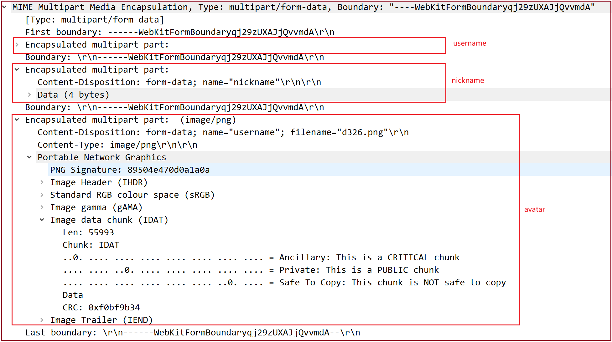

可以看到：文件倒是能上传了，但是多了一些 Boundary 的东西，包括普通表单项也是如此，

此时 也无法通过 HttpServletRequest 的 getParameter() 来获取参数

<br>

如果我们通过 流 获得这个文件（请求体），那么必须先处理掉这些 Boundary ，自己解析各个表单项、分离文件并保存

这个过程还是相当繁琐的，这里借助 Apache 的 FileUpload 即可


<br>

### FileUpload

Commons-FileUpload组件是Apache组织jakarta-commons项目组下的一个小项目，

该组件可以方便地将multipart/form-data类型请求中的各种表单域解析出来，并实现一个或多个文件的上传，

同时也可以限制上传文件的大小等内容

官网：http://commons.apache.org/proper/commons-fileupload/ 

<br>

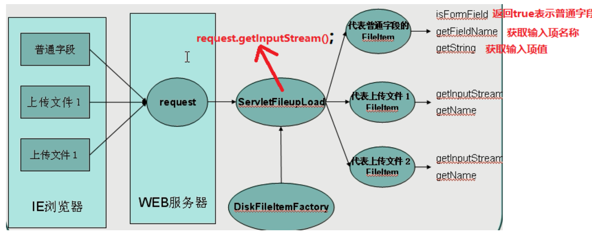

```java

fileupload核心API:

1. DiskFileItemFactory  
    1) DiskFileItemFactory()        // 构造器  使用默认配置
    2) DiskFileItemFactory(int sizeThreshold, File repository)
      // sizeThreshold 内存缓冲区, 不能设置太大, 否则会导致JVM崩溃
      // repository    临时文件目录

2. ServletFileUpload
  1) isMutipartContent(request) // 判断上传表单是否为multipart/form-data类型 true/false
  2) parseRequest(request)      // 解析request, 返回值为List<FileItem>类型
  3) setFileSizeMax(long)       // 上传文件单个最大值 fileupload内部通过抛出异常的形式处理, 
    						    // 处理文件大小超出限制, 可以通过捕获这个异常, 提示给用户
  4) setSizeMax(long)           // 上传文件总量最大值
  5) setHeaderEncoding(String)  // 设置编码格式
    
  6) setProgressListener(ProgressListener)  // 设置监听器, 可以用于制作进度条

```


<br>

```java
/*

一 中文乱码问题

 1). 表单数据中文乱码
	fileItem.getString("utf-8");
	
 2).上传的文件名有中文乱码问题
 	upload.setHeaderEncoding("utf-8");
 	
 	
 	
二 目录内文件数过多的问题 -- 目录内文件数过多，会影响当前文件的加载查询效率(磁盘IO)

    目录创建多个。 按照年、月、日。不稳定。文件分散不均匀。同时目录也不会特别多。

    使用hash算法产生图片上传的随机目录 -- 为了防止一个目录中出现太多文件, 使用算法打散存储  */


    public String generatePath(String savePath, String originFileName) {
        String fileName = getFileName(originFileName);
        
        //文件名取 32 位的 hashcode
        int hashCode = fileName.hashCode();
        // 4位 对应一位 十六进制，--> 转换为一个八位的十六进制字符串
        String hexString = Integer.toHexString(hashCode);
        
        // 生成目录结构
        char[] chars = hexString.toCharArray();
        String basePath = "file";              // 文件都放在应用根路径下的 file 目录下
        for (char aChar : chars) {
            basePath = basePath + "/" + aChar;
        }
		
        String relativePath = basePath + "/" + fileName;
    }
    
	/***
     * 生成唯一的文件名
     * @author itdrizzle
     * @date 2022/4/12 20:08
     * @return {@link File}
     */
    private static String getFileName(String originFileName) {
        // 获取文件后缀名   新的文件名：当前日期(也可以使用用户id) + UUID + 文件后缀名
        int index = originFileName.lastIndexOf(".");
        String suffix = originFileName.substring(index);

        String uuid = UUID.randomUUID().toString();
        SimpleDateFormat sdf = new SimpleDateFormat("yyyy-MM-dd-HH-mm-ss");
        String formatDate = sdf.format(new Date());

        return formatDate + "-" + uuid + suffix;
    }

```

<br>

```java

// 三 监听文件上传进度  （ 监听器要在request解析之前设置）

ServletFileUpload upload = new ServletFileUpload(factory);
upload.setProgressListener(new ProgressListener(){
    
    // pBytesRead      当前已上传大小
    // pContentLength  文件总大小
    // arg2            当前解析的item
    public void update(long pBytesRead, long pContentLength, int arg2) {
        System.out.println("文件大小为：" + pContentLength + ", 当前已处理：" + pBytesRead);
    }
    
});

```


<br>

```java
/*

JavaEE项目中通过fileupload新上传的图片文件要等至少5秒以后才能访问? （使用Tomcat）

	有人说Tomcat7没有这个问题，但经过实际测试，结果是一样的（至少我亲自尝试了Tomcat7 - Tomcat10 ）

有这样一种说法：
	这是因为Tomcat8起、其IO不再是传统的BIO，其底层复制文件的过程中使用了Channel
	
	但仅凭直觉都知道不对，为什么无论上传什么文件都是上传后5秒内无法访问，怎么可能呢？
	严谨一点，通过追踪fileupload源码（追踪 FileItem 的 write方法 发现）可以发现只有在上传文件大小超过内存缓冲区的情形下，
	才会涉及文件的复制（这时才会使用通道），
	而一般的小文件，直接从内存写入硬盘。 参考下面部分源码：

```

<br>


<br>

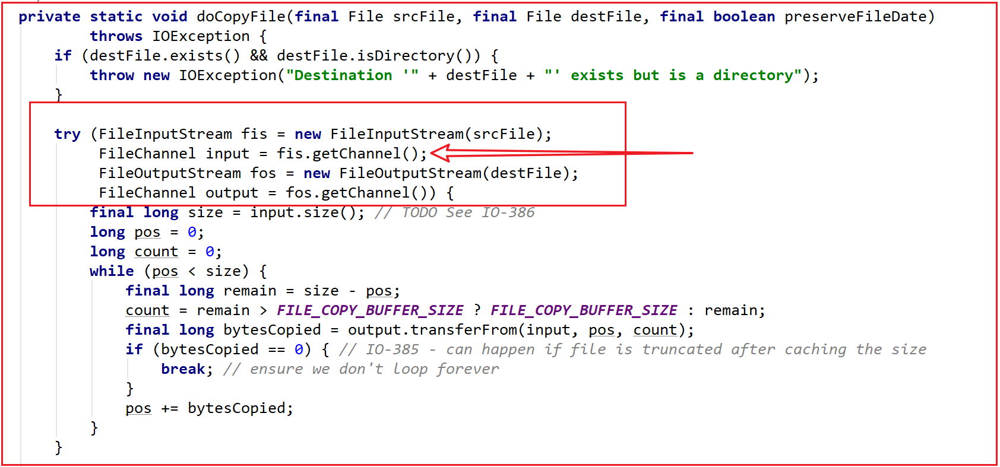

<br>

```java
/**

事实上，在此基本上可以确定这个问题与上传没有太大关系，可以通过自己实现 DefaultServlet （即 `/`）
直接用文件名获取文件来验证（使用IO流直接读硬盘文件）

或者不在IDEA中操作，直接启动本地的Tomcat，复制一个文件到webapp目录下的任何一个应用，5秒内快速访问该资源你就会明白了

不知出于何种原因，Tomcat在启动后部署资源后要5秒后才能访问到，个人有一些猜测：

	Tomcat具备热部署的特性，在用户访问资源时，如果每次都去硬盘查询资源，效率肯定极低，
	
	想想自己实现一个Tomcat，你会让每次请求都去查询硬盘吗？
	
	通常的做法，应该会在内存中维护一些 servlet、文件资源 和 请求路径的对应关系，Tomcat接收到请求后，
	先在内存中查询是否有对应资源，有的话再去获取该资源文件
	
	问题也许就在这儿，我们上传文件时、或者对Tomcat内应用的资源做了变动，不太可能做到实时修改Tomcat内存中的对应关系信息
	常用的策略或许是有一个（或一些）扫描应用资源的线程，周期性的将资源变动信息同步到内存中，而5秒延迟，或许也是因此而来
	以上纯属个人猜想，无任何依据，但这个答案应该比较接近事实了，有空只能通过调试Tomcat源码来验证了

```


<br>


### 文件上传示例

FileUpload上传文件步骤：

```xml

<!--maven导入FileUpload依赖-->
<dependency>
    <groupId>commons-fileupload</groupId>
    <artifactId>commons-fileupload</artifactId>
    <version>1.4</version>
</dependency>
<dependency>
    <groupId>commons-io</groupId>
    <artifactId>commons-io</artifactId>
    <version>2.6</version>
</dependency>

```

<br>


```java

/**
 * @Classname FileUploadUtil
 * @Description TODO
 * @Date 2022/4/12 19:41
 * @Author idrizzle
 */
public class FileUploadUtil {

    /**
     * 利用 fileupload 处理文件上传相关业务
     * 将各个表单项和文件上传后的网络路径 put 到 map 中
     * @author itdrizzle
     * @date 2022/4/12 19:42
     */
    public static void upload(HttpServletRequest request, Map<String, Object> map) throws Exception {
        DiskFileItemFactory factory = new DiskFileItemFactory();
        factory.setSizeThreshold(1024 * 1024 * 1024);              // 内存缓冲区大小
        factory.setRepository(factory.getRepository());            // 设置存放临时文件的目录
        ServletFileUpload upload = new ServletFileUpload(factory);
        upload.setHeaderEncoding("utf-8");                         // 可以解决上传文件名中文乱码问题

        // 通过parseRequest()方法获取的全部表单项将保存到List集合中，
        // 并且保存到List集合中的表单项，不管是文件域还是普通表单域，都将当成FileItem对象处理
        List<FileItem> fileItems = upload.parseRequest(request);

        for (FileItem item : fileItems) {
            // 判断是文件还是普通表单
            if (item.isFormField()) {
                // 普通表单域
                map.put(item.getFieldName(), item.getString("utf-8"));
            } else {
                // 文件
                String originFileName = item.getName();         // 文件名
                // long fileSize = item.getSize();              // 文件大小
                // String contentType = item.getContentType();  // 文件类型

                String fileName = getFileName(originFileName);
                String relativePath = "file/" + fileName;

                String realPath = request.getServletContext().getRealPath(relativePath);
                File file = new File(realPath);
                if(!file.getParentFile().exists()){
                    file.getParentFile().mkdirs();
                }

                // 上传文件
                item.write(file);
                map.put(item.getFieldName(), request.getContextPath() + "/" + relativePath);
            }
        }

    }

    /***
     * 生成存放文件的目录、及唯一的文件名
     * @author itdrizzle
     * @date 2022/4/12 20:08
     * @return {@link File}
     */
    private static String getFileName(String originFileName) {
        // 获取文件后缀名   新的文件名：当前日期 + UUID + 文件后缀名
        int index = originFileName.lastIndexOf(".");
        String suffix = originFileName.substring(index);

        String uuid = UUID.randomUUID().toString();
        SimpleDateFormat sdf = new SimpleDateFormat("yyyy-MM-dd-HH-mm-ss");
        String formatDate = sdf.format(new Date());

        return formatDate + "-" + uuid + suffix;
    }
}

```

<br>

```java

@WebServlet("/user/*")
public class UserServlet extends HttpServlet {

    @SneakyThrows
    protected void doPost(HttpServletRequest request, HttpServletResponse response) {
        String contextPath = request.getContextPath();  // contextPath = /app
        String servletPath = request.getServletPath();  // servletPath = /user
        String requestURI = request.getRequestURI();    // requestURI = /app/user/login

        String path = requestURI.replace(contextPath + servletPath + "/", "");  // login

        if ("login".equals(path)) {
            // 登录
            login(request, response);
        } else if ("info".equals(path)) {
            // 显示用户信息
            info(request, response);
        } else if ("update".equals(path)) {
            // 修改用户信息
            updateProfile(request, response);
        }
    }


    protected void doGet(HttpServletRequest request, HttpServletResponse response)  {
        //
        this.doPost(request, response);
    }


    /**
     * 展示用户信息
     * @author itdrizzle
     * @date 2022/4/12 19:18
     */
    private void info(HttpServletRequest request, HttpServletResponse response) 
        throws InvocationTargetException, IllegalAccessException, IOException {
        Cookie[] cookies = request.getCookies();
        User user = new User();
        Map<String, Object> map = new HashMap<>();
        for (Cookie cookie : cookies) {
            map.put(cookie.getName(), cookie.getValue());
        }
        BeanUtils.populate(user, map);

        StringBuilder sb = new StringBuilder();
        sb.append("用户名：").append(user.getUsername()).append("<br>");
        sb.append("密码：").append(user.getPassword()).append("<br>");
        sb.append("性别：").append(user.getGender()).append("<br>");
        sb.append("头像：").append("<br>").append("");

        response.setContentType("text/html;charset=utf-8");

        response.getWriter().println(sb.toString());

    }

    /**
     * 修改用户信息
     * @author itdrizzle
     * @date 2022/4/12 19:33
     */
    private void updateProfile(HttpServletRequest request, HttpServletResponse response) throws Exception {

        Map<String, Object> params = new HashMap<>();
        FileUploadUtil.upload(request, params);

        User user = new User();
        BeanUtils.populate(user, params);

        for (String key : params.keySet()) {
            Cookie cookie = new Cookie(key, params.get(key).toString());
            response.addCookie(cookie);
        }
        response.setHeader("refresh", "5;url=/app/user/info");
        response.setContentType("text/html;charset=utf-8");
        response.getWriter().println("上传成功，5秒后将跳转至info页面");
    }
}

```

<br>

```html
<!DOCTYPE html>
<html lang="en">
    <head>
        <meta charset="UTF-8">
        <title>Profile</title>
        <style type="text/css">

            .container {
                height: 500px;
                margin-top: 100px;
            }

            .item {
                width: 500px;
                height: 50px;
                padding: 5px 10px;
                margin: 5px auto;
            }

            label {
                display: inline-block;
                width: 100px;
                text-align: right;
            }

            input {
                width: 200px;
                height: 30px;
            }

            .button {
                height: 40px;
                margin-left: 105px;
                background-color: #5c8abe;
            }

            .radio {
                display: inline;
                width: 20px;
                height: 20px;
            }

        </style>
    </head>
    <body>

        <div class="container">
            <form method="post" action="/app/user/update" enctype="multipart/form-data">
                <div class="item">
                    <label for="username">UserName: </label>
                    <input type="text" name="username" id="username"/>
                </div>
                <div class="item">
                    <label for="password">Password: </label>
                    <input type="password" name="password" id="password"/>
                </div>

                <div class="item">
                    <label>Gender: </label>
                    <input type="radio" name="gender" value="male" class="radio"/> male
                    <input type="radio" name="gender" value="female" class="radio"/> female
                </div>

                <div class="item">
                    <label for="avatar">Avatar: </label>
                    <input type="file" name="avatar" id="avatar" />
                </div>

                <div class="item">
                    <input type="submit" value="提交" class="button" />
                </div>

            </form>

        </div>
    </body>
</html>
```

<br/>

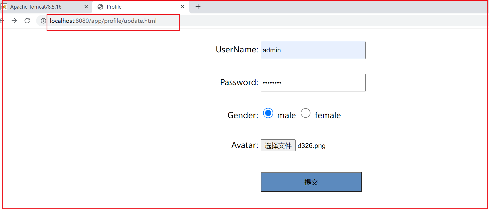

<br>


<br>

### 文件的下载

```java
// 下载文件：对于可以打开的文件，默认执行打开操作，对于无法打开的文件，默认执行下载操作，是无需服务器做出任何设置的。
// 但如果某个文件是客户端可以打开的，但是我们希望客户端可以将其执行下载操作，而不是打开，那么设置一个响应头即可

protected void doGet(HttpServletRequest request, HttpServletResponse response) 
    throws ServletException, IOException {
    
        response.setHeader("Content-Disposition", "attachment;filename=1.jpeg");
    
        ServletOutputStream outputStream = response.getOutputStream();
        //输入流 应用根目录下1.jpeg(路径)文件输入流
        String realPath = getServletContext().getRealPath("1.jpeg");
        FileInputStream inputStream = new FileInputStream(new File(realPath));
    
        int length = 0;
        byte[] bytes = new byte[1024];
        while ((length = inputStream.read(bytes)) != -1){
            outputStream.write(bytes, 0, length);
        }
        //关闭流 ServletOutputStream可以关，也可以不关，如果不关，那么tomcat会帮你关
        outputStream.close();
        inputStream.close();

    }

```


