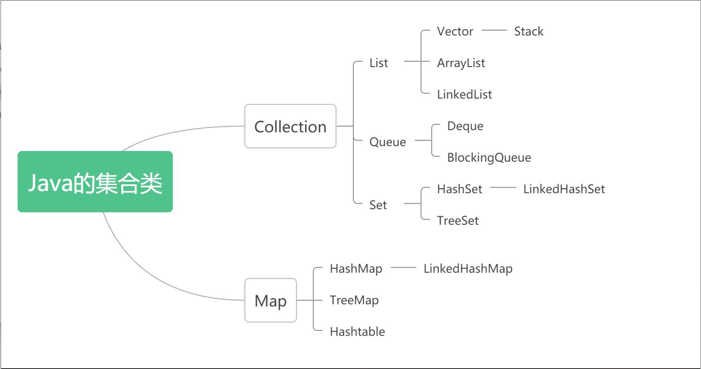
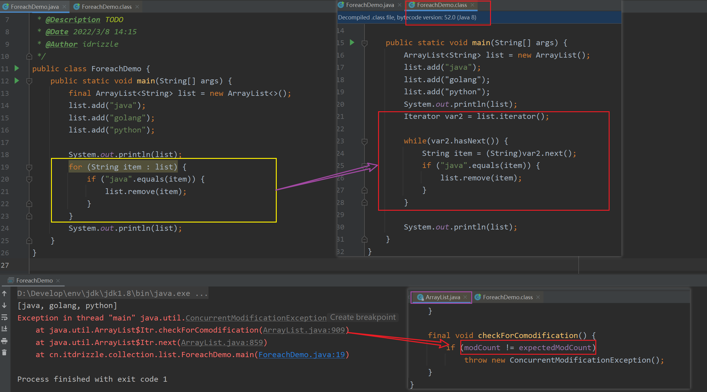

---

order: 80

---

# Java集合类

为了保存数量不确定的数据，以及保存具有映射关系的数据（也被称为关联数组），Java提供了集合类。集合类主要负责保存、盛装其他数据，因此集合类也被称为容器类。

- 集合类和数组不一样，数组元素既可以是基本类型的值，也可以是对象（实际上保存的是对象的引用变量），

- 而集合里只能保存对象（实际上只是保存对象的引用变量）

Java 集合类型分为 Collection 和 Map，它们是 Java 集合的根接口，下图为Collection 和 Map 的子接口及其常用实现类：

```java
集合类的分类:

​    Collection集合体系: 存储单个数据

​    Map集合体系: 存储的都是key-value数据 (具有自我描述性 )
```



Java集合接口的作用：

| 接口名称       | 作  用                                                                                                            |
| ---------- | --------------------------------------------------------------------------------------------------------------- |
| Iterator   | 集合的输出接口，主要用于遍历输出（即迭代访问）Collection 集合中的元素，Iterator 对象被称之为迭代器。迭代器接口是集合接口的父接口，实现类实现 Collection 时就必须实现 Iterator 接口。 |
| Collection | 是 List、Set 和 Queue 的父接口，是存放一组单值的最大接口。所谓的单值是指集合中的每个元素都是一个对象。一般很少直接使用此接口直接操作。                                     |
| Queue      | Queue 是 Java 提供的队列实现，有点类似于 List。                                                                                |
| Dueue      | 是 Queue 的一个子接口，为双向队列。                                                                                           |
| List       | 是最常用的接口。是有序集合，允许有相同的元素。使用 List 能够精确地控制每个元素插入的位置，用户能够使用索引（元素在 List 中的位置，类似于数组下标）来访问 List 中的元素，与数组类似。             |
| Set        | 不能包含重复的元素。                                                                                                      |
| Map        | 是存放一对值的最大接口，即接口中的每个元素都是一对，以 `key➡value` 的形式保存。                                                                  |

Java集合实现类的作用：

| Class      | description                             |
| ---------- | --------------------------------------- |
| ArrayList  | 底层是数组结构实现，查询快、增删慢                       |
| LinkedList | 底层是链表结构实现，查询慢、增删快                       |
| Vector     | 相对于ArrayList来说，它是线程安全的，同时提供了指定扩容增量的构造方法 |
| HashSet    | 底层数据结构是哈希表, 无序，不包含重复元素（为优化査询速度而设计）      |
| HsahMap    | 按哈希算法来存取键对象                             |

## 1. Collection

**Collection的特点: (背会)** 

```java
// 1, Collection是Collection集合体系的顶级接口
// 2, Collection定义了一个容器
// 3, Collection的一些子实现是有序的, Collection的另一些子实现是无序的
// 4, Collection的一些子实现允许存储重复元素, Collection的另一些子实现不允许存储重复元素
// 5, Collection的一些子实现允许存储null, Collection的另一些子实现不允许存储null
```

 **Collection的api: (记住)** 

Collection中定义了单列集合(List和Set)通用的一些方法， 这些方法可用于操作所有的单列集合。方法如下： 

```java
boolean add(E e)                               // 把给定的对象添加到当前集合中
boolean addAll(Collection<? extends E> c)      // 添加所有
boolean contains(Object o)                     // 查找某个元素是否存在
boolean containsAll(Collection<?> c)           // 判断集合中的元素是否都存在
boolean remove(Object o)                       // 删除某个内容
boolean removeAll(Collection<?> c)             // 删除所有匹配元素
boolean retainAll(Collection<?> c)             // 保留所有匹配元素

void clear()                                   // 数据清空
boolean equals(Object o)                       // 集合类重写了equals方法, 是按照内容进行比较是否重复
int hashCode()
boolean isEmpty()
int size()


Object[] toArray()                             // 把Collection中所有的数据, 存储到一个数组并返回
<T> T[] toArray(T[] a)                         // 泛型方法, 返回包含此 collection 中所有元素的数组；
/* 返回数组的运行时类型与指定数组的运行时类型相同。

注意1: toArray()无参的toArray方法返回 Object[]数组, 因为没有办法根据泛型new对应类型数组
注意2: 为什么提供一个泛型方法:  <T> T[] toArray(T[] a): 泛型方法, 就是为了弥补注意1的缺陷
注意3: 这是个泛型方法, 但是并不意味者, 我们可以传任何类型的数组(虽然编译通过, 运行报错)
注意4: 如果泛型toArray数组给定不够长, 那么返回的数组和参数数组不是同一个
       如果数组给的足够长,返回的数组和参数数组是同一个数组
       如果数组给定太长了, 假设集合类存储了n个元素, 
       数组从0-n-1就是集合元素, 下标为n位置置位null, n之后的数组位置不处理
*/


Iterator<E> iterator()                          // 返回在此 collection 的元素上进行迭代的迭代器。
```

## 2. List(线性表)

List特点：

> 1. List是Collection的子接口
> 2. List在Collection的基础上，定义为一个线性表
> 3. List的子实现都是有序的
> 4. List的子实现允许存储重复元素
> 5. List的子实现允许存储null

api：

```java
//        boolean add(E e): 添加方法
//        boolean addAll(Collection<? extends E> c): 添加所有
//        boolean contains(Object o): 查找某个元素是否存在
//        boolean containsAll(Collection<?> c): 查找某些元素是否都存在
//        boolean remove(Object o): 根据内容删除
//        boolean removeAll(Collection<?> c): 删除所有
//        boolean retainAll(Collection<?> c): 保留所有匹配元素

//        void clear(): 清空
//        boolean equals(Object o)
//        int hashCode()
//        boolean isEmpty()
//        int size()
```

```java
void add(int index, E element)                        // 添加到指定下标位置
boolean addAll(int index, Collection<? extends E> c)  // 把所有元素添加到指定下标位置
E get(int index)                                      // 根据下标查找对应下标存储内容:  最最重要
E remove(int index)                                   // 删除指定下标的元素
E set(int index, E element)                           // 修改指定位置的数据
int indexOf(Object o)                                 // 查找某个元素第一次出现的下标
int lastIndexOf(Object o)                             // 查找某个元素最后一次出现的下标
```

```Java
// toArray各种特点和Collection一模一样

Object[] toArray()       // 返回按适当顺序包含列表中的所有元素的数组（从第一个元素到最后一个元素）

<T> T[]  toArray(T[] a)  // 返回按适当顺序（从第一个元素到最后一个元素）包含列表中所有元素的数组；
                         // 返回数组的运行时类型是指定数组的运行时类型
```

**ListIterator** : 重点提供向前遍历的方法

```Java
Iterator<E> iterator()                   // 返回按适当顺序在列表的元素上进行迭代的迭代器。
ListIterator<E> listIterator()           // 返回此列表元素的列表迭代器（按适当顺序）。
ListIterator<E> listIterator(int index)  // 返回列表中元素的列表迭代器（按适当顺序），从列表的指定位置开始   
```

<br/>

**视图方法**：

```java
List<E> subList(int fromIndex, int toIndex) // 返回 fromIndex（包括 ）和 toIndex（不包括）之间的部分'视图'
```

> 视图方法:   通过视图方法获得的数据, 并不是真的复制了数据, 而是视图方法返回一个对象, 
>                    这个返回的对象内部维护了一些指向源数据的标记  
> 
>    -->           视图方法获得的数据, 还是源数据
> 
> 注意: 视图方法使用的过程中, 也可能会抛出并发修改异常
> 
> 怎么避免？ 在使用完通过视图方法获得的对象之前, 不要调用原集合类修改结构的方法修改原集合数据

<br/>

### 1) ArrayList

**ArrayList的特点**：

```java
// 1, ArrayList 是 List接口的子实现
// 2, ArrayList描述的数据结构是线性表
// 3, ArrayList的底层结构是数组
// 4, ArrayList默认的初始容量：10,  扩容机制：原来的1.5倍
// 5, 存储元素有序
// 6, 允许存储重复元素
// 7, 允许存储null
// 8, 线程不安全
```

- ArrayList的默认构造函数会初始化一个空数组，第一次添加元素时才扩容至10（ JDK8 中改为这种懒加载模式？）
- 建议开发中如果能知道数组大小，预先指定大小避免多次扩容、 复制数据

ArrayList类的常用方法：

| 方法名称                                          | 说明                                                                                   |
| --------------------------------------------- | ------------------------------------------------------------------------------------ |
| public boolean add(E e)                       | 添加过程中会自动扩容，返回结果一定为true                                                               |
| E get(int index)                              | 获取此集合中指定索引位置的元素，E 为集合中元素的数据类型                                                        |
| int index(Object o)                           | 返回此集合中第一次出现指定元素的索引，如果此集合不包含该元 素，则返回 -1                                               |
| int lastIndexOf(Object o)                     | 返回此集合中最后一次出现指定元素的索引，如果此集合不包含该 元素，则返回 -1                                              |
| E set(int index, Eelement)                    | 将此集合中指定索引位置的元素修改为 element 参数指定的对象。 此方法返回此集合中指定索引位置的原元素                               |
| List\<E\> subList(int fromlndex, int tolndex) | 返回一个新的集合，新集合中包含 fromlndex 和 tolndex 索引之间 的所有元素。包含 fromlndex 处的元素，不包含 tolndex 索引处的 元素 |

```java
ArrayList实现了, Collection以及List定义的所有api

其它:
//        void ensureCapacity(int minCapacity)
//        如有必要，增加此 ArrayList 实例的容量，以确保它至少能够容纳最小容量参数所指定的元素数。

//        void trimToSize()
//        将此 ArrayList 实例的容量调整为列表的当前大小。


//        Object clone()
//        返回此 ArrayList 实例的浅表副本。
```

注意: ArrayList的clone方法, 复制两层, 一个ArrayList对象本身会复制, 另外一层是ArrayList对象的持有的elementData也会复制, 在elementData存储的数据就不会再复制了


<br/>

**subList() 在ArrayList上的表现**：

subList() 方法实际返回了一个 SubList 的内部类，SubList继承AbstractList抽象类，AbstractList实现了List接口，所以SubList说到底就是一个List的实现类，主要用于返回List的 **视图**（来源于数据库、 在口语化上又叫"虚表"  ），这个视图是原List对象中的一部分，确实是一部分，直接将原List对象引用到新的子视图的List，对子视图进行改变，原List对象也会随之改变

```java
class ArrayList{
   Object[] elementData;

   public List<E> subList(int fromIndex, int toIndex) {
        subListRangeCheck(fromIndex, toIndex, size);
        return new SubList(this, 0, fromIndex, toIndex);
    }

     private class SubList extends AbstractList<E> implements RandomAccess {
        private final AbstractList<E> parent; // 表示外层对象
        private final int parentOffset; // 起始下标
        private final int offset;
        int size; // 标记的数据个数

        // ......
     }

    // ......
 }
```

在List中使用subList要小心，因为本身SubList这个类就是原List的一个视图，改变 SubList 必定会改变原List

Java开发手册强制规定：


<br/>

补充: 可选操作

比如Collection定义了一些api,  子实现有些api可以选择不实现(在实现的方法体内直接抛出`UnsupportedOperationException` )

```java
public class MyCollection implements Collection<String> {

    @Override
    public boolean add(String s) {
       throw new UnsupportedOperationException();
    }
}
```

### 2) Vector

Vector 类实现了一个动态数组。和 ArrayList 很相似，但是两者是不同的：

- Vector 是同步访问的（线程安全的）
- Vector 还包含了许多传统的方法，这些方法不属于集合框架。

```java
// 1, 它是List的一个子实现
// 2, 描述的数据结构是一个线性表
// 3, 底层结构是一个数组
// 4, 默认初始容量 10,  扩容机制: 如果存在一个大于零的增量扩大增量个, 如果增量小于等于0, 扩为原来的2倍
// 5, 有序
// 6, 允许重复
// 7, 允许存储null
// 8, 线程安全
// 9, Vector是jdk1.0时候出现的


// 构造方法和api不需要记(有兴趣可以去研究)
```

Vector 类的4种构造方法：

```java
Vector()                    // 默认大小为 10
Vector(int size)            // 指定大小
Vector(int size,int incr)   // 指定大小，并且增量用 incr 指定（增量表示每次增加的元素数目）
Vector(Collection c)        // 创建一个包含集合的Vector
```

当Vector容量不足以容纳全部元素时，Vector的容量会增加。**若容量增加系数 >0，则将容量的值增加“容量增加系数”；否则，将容量大小增加一倍。**

### 3) LinkedList

```java
// 1, LinkedList不仅仅是List接口的一个子实现, 还是Deque接口的一个子实现
// 2, LinkedList首先可以作为一个普通的线性表, 还可以作为队列/双端队列/栈使用
// 3, 底层是一个双向链表
// 4, 有序
// 5, 允许存储重复元素
// 6, 允许存储null元素
// 7, 线程不安全
```

**构造方法** ：

```java
LinkedList()   // 构造一个空列表。 
LinkedList(Collection<? extends E> c) 
               // 构造一个包含指定 collection 中的元素的列表，这些元素按其 collection 的迭代器返回的顺序排列
```

api：

```Java
//        boolean add(E e)                                           // 添加方法
//        void add(int index, E element)                             // 根据下标的添加
//        boolean addAll(Collection<? extends E> c)                  // 添加所有
//        boolean addAll(int index, Collection<? extends E> c)       // 根据下标添加所有

//        boolean contains(Object o)    // 如果此列表包含指定元素，则返回 true。
//        E get(int index)              // 返回此列表中指定位置处的元素。
//        int indexOf(Object o)         // 返回此列表中首次出现的指定元素的索引，如果此列表中不包含该元素，则返回 -1
//        int lastIndexOf(Object o)     // 返回此列表中最后出现的指定元素的索引，如果此列表中不包含该元素，则返回 -1

//        E remove(int index)           // 移除此列表中指定位置处的元素。
//        boolean remove(Object o)      // 从此列表中移除首次出现的指定元素（如果存在）。
//        E set(int index, E element)   // 将此列表中指定位置的元素替换为指定的元素

//        int size()                    // 返回此列表的元素数。
//        void clear()                  // 从此列表中移除所有元素。
//        Object clone()                // 返回此 LinkedList 的浅表副本。

//        Object[] toArray()            // 返回以适当顺序（从第一个元素到最后一个元素）包含此列表中所有元素的数组
//        <T> T[] toArray(T[] a)        // 返回以适当顺序（从第一个元素到最后一个元素）包含此列表中所有元素的数组；
                                        // 返回数组的运行时类型为指定数组的类型。
```

LinkedList 类除了包含 Collection 接口和 List 接口中的所有方法之外，还特别提供了下面的方法：

| 方法名称                                    | 说明                              |
| --------------------------------------- | ------------------------------- |
| void addFirst(E e)                      | 将指定元素添加到此集合的开头                  |
| void addLast(E e)                       | 将指定元素添加到此集合的末尾                  |
| E getFirst()                            | 返回此集合的第一个元素                     |
| E getLast()                             | 返回此集合的最后一个元素                    |
| E element()                             | 获取但不移除此列表的头（第一个元素）              |
| E remove()                              | 获取并移除此列表的头（第一个元素）               |
| E removeFirst()                         | 删除此集合中的第一个元素                    |
| E removeLast()                          | 删除此集合中的最后一个元素                   |
| boolean removeFirstOccurrence(Object o) | 从此列表中移除第一次出现的指定元素（从头部到尾部遍历列表时）  |
| boolean removeLastOccurrence(Object o)  | 从此列表中移除最后一次出现的指定元素（从头部到尾部遍历列表时） |


```java
ListIterator<E> listIterator(int index)  // 返回列表迭代器（按适当顺序），从列表中指定位置开始
Iterator<E> descendingIterator()         // 返回以逆向顺序进行迭代的迭代器
```


```java
//------------------------------ 作为队列的api
boolean offer(E e) // 将指定元素添加到此列表的末尾（最后一个元素）
E poll()           // 获取并移除此列表的头（第一个元素）
E peek()           // 获取但不移除此列表的头（第一个元素）
```

<br/>

```Java
//------------------------------ 作为双端队列的api
boolean offerFirst(E e)    // 在此列表的开头插入指定的元素。
boolean offerLast(E e)     // 在此列表末尾插入指定的元素。
E peekFirst()              // 获取但不移除此列表的第一个元素；如果此列表为空，则返回 null。
E peekLast()               // 获取但不移除此列表的最后一个元素；如果此列表为空，则返回 null。
E pollFirst()              // 获取并移除此列表的第一个元素；如果此列表为空，则返回 null。
E pollLast()               // 获取并移除此列表的最后一个元素；如果此列表为空，则返回 null。
```

<br/>

```java
//------------------------------ 作为栈的api
E pop()             // 从此列表所表示的堆栈处弹出一个元素。
void push(E e)      // 将元素推入此列表所表示的堆栈。
```

<br/>

## 3. 栈和队列

### 1) Stack

```java
// 1, Stack是vector一个子类
// 2, 数据结构是一个栈
// 3, 底层结构是一个数组
// 4, 默认的初始长度10, 默认扩容机制:2倍
// 5, 有序
// 6, 允许重复
// 7, 允许存储null
// 8, 线程安全
```

注意1:  Stack是Vector子类, 也就是可以从语法上使用Vector实现的 api(add, addAll....),  但是习惯上还是不要用, 因为我们创建一个Stack还是希望它作为一个栈存在(使用 push, pop, peek方法)

注意2: 文档上推荐, 如果我们需要使用栈的时候, 用Deque接口下的子实现, 而非使用Stack 

<br/>

### 2) Queue

```Java
1. Queue 是collection 的一个子接口
2. QUeue 定义为一个队列
3. 允许存储元素有序
4. 允许存储重复元素
5. Queue的子实现不允许存储 null （LinkedList除外）
  // 因为Queue提供了一个poll方法, 当队列没有元素可以出队列的时候, poll方法返回一个null标记队列没有存储元素, 
  // 所以如果Queue允许存储null, 在删除的时候, 就没办法分辨到底是存储的null, 还是没有元素了
```

<br/>

```java
boolean offer(E e)     // 将指定的元素插入此队列（如果立即可行且不会违反容量限制）
                       // 当使用有容量限制的队列时，此方法通常要优于 add(E)，后者可能无法插入元素，而只是抛出一个异常

E peek()               // 获取但不移除此队列的头；如果此队列为空，则返回 null
E poll()               // 获取并移除此队列的头，如果此队列为空，则返回 null

E element()            // 获取，但是不移除此队列的头
E remove()             // 获取并移除此队列的头
```

<br/>

### 3) Deque

```Java
// 1, Deque是Queue 接口的一个子接口
// 2, 在队列基础上, 定义了双端队列/栈(Deque从数据结构可以描述: 队列/双端队列/栈)
// 3, 存储元素有序
// 4, 允许存储重复元素
// 5, Deque的子实现不允许存储null  (LinkedList除外)
```

<br/>

```java
 boolean add(E e)    // 如果成功，则返回 true，如果当前没有可用空间，则抛出 IllegalStateException。 
 void addFirst(E e)  // 将指定元素插入此双端队列的开头（如果可以直接这样做而不违反容量限制）。 
 void addLast(E e)   // 将指定元素插入此双端队列的末尾（如果可以直接这样做而不违反容量限制）。 

 boolean contains(Object o)   // 如果此双端队列包含指定元素，则返回 true。 
 E element()                  // 获取，但不移除此双端队列所表示的队列的头部（此双端队列的第一个元素）
 E getFirst()                 // 获取，但不移除此双端队列的第一个元素。 
 E getLast()                  // 获取，但不移除此双端队列的最后一个元素。 

 int size()                   //  返回此双端队列的元素数。

 E remove()                   // 获取并移除此双端队列所表示的队列的头部（换句话说，此双端队列的第一个元素）。 
 boolean remove(Object o)     // 从此双端队列中移除第一次出现的指定元素。 
 E removeFirst()              // 获取并移除此双端队列第一个元素。 
 E removeLast()               // 获取并移除此双端队列的最后一个元素。 

 boolean removeFirstOccurrence(Object o)  // 从此双端队列移除第一次出现的指定元素。 
 boolean removeLastOccurrence(Object o)   // 从此双端队列移除最后一次出现的指定元素。 


 boolean offer(E e)                 // 将指定元素插入此双端队列所表示的队列（此双端队列的尾部）
 boolean offerFirst(E e)            // 在不违反容量限制的情况下，将指定的元素插入此双端队列的开头。 
 boolean offerLast(E e)             // 在不违反容量限制的情况下，将指定的元素插入此双端队列的末尾。 

 E peek()               // 获取但不移除此双端队列所表示的队列的头部, 如果此双端队列为空，则返回 null 
 E peekFirst()          // 获取，但不移除此双端队列的第一个元素；如果此双端队列为空，则返回 null。 
 E peekLast()           // 获取，但不移除此双端队列的最后一个元素；如果此双端队列为空，则返回 null。 

 E poll()               // 获取并移除此双端队列所表示的队列的头部；如果此双端队列为空，则返回 null。 
 E pollFirst()          // 获取并移除此双端队列的第一个元素；如果此双端队列为空，则返回 null。 
 E pollLast()           // 获取并移除此双端队列的最后一个元素；如果此双端队列为空，则返回 null。 


 Iterator<E> descendingIterator()   // 返回以逆向顺序在此双端队列的元素上进行迭代的迭代器。 
 Iterator<E> iterator()             // 返回以恰当顺序在此双端队列的元素上进行迭代的迭代器。 


 E pop()        // 从此双端队列所表示的堆栈中弹出一个元素。 
 void push(E e) // 将一个元素推入此双端队列所表示的堆栈（换句话说，此双端队列的头部），
                // 如果可以直接这样做而不违反容量限制的话；如果成功，则返回 true，
                // 如果当前没有可用空间，则抛出 IllegalStateException。 
```

<br/>

### 4) ArrayDeque

```java
// 1, ArrayDeque是Deque接口的子实现
// 2, ArrayDeque描述的数据结构: 队列/双端队列/栈
// 3, 底层结构是数组(循环数组)
// 4, 初始容量 16,  扩容机制: 扩为原来的2倍
// 5, 有序
// 6, 允许重复元素
// 7, 不允许存储null
// 8, 线程不安全
// 9, 如果我们在构造方法里指定了数组长度: 实际上底层会产生一个大于给定值最小的2的幂值作为底层数组长度
      --> ArrayDeque底层数组长度永远是2的幂值
```

ArrayDeque和LinkedList都实现了Deque接口，应该用哪一个呢？

如果只需要Deque接口，从两端进行操作，一般而言，ArrayDeque效率更高一些，应该被优先使用；

如果同时需要根据索引位置进行操作，或者经常需要在中间进行插入和删除，则应该选LinkedList。

<br/>

### 5) BlockingQueue

```Java
// 1, BlockingQueue是一个阻塞队列(是个接口)
// 2, BlockingQueue 方法(四类方法)
//    重点注意: put和take方法
```


```vb
// 什么是阻塞队列? 大小有限的队列
//   当队列添加满的时候, 添加线程等待/阻塞
//   当队列为空的时候, 删除线程等待/阻塞
```


<br/>

## 4. 遍历集合

### 1) Iterator

Iterator（迭代器）是一个接口，它的作用就是遍历容器的所有元素，也是Java 集合框架的成员

- Collection 和 Map 系列集合主要用于盛装其他对象
- Iterator 则主要用于遍历（即迭代访问）Collection 集合中的元素

Iterator 接口隐藏了各种 Collection 实现类的底层细节，向应用程序提供了遍历 Collection 集合元素的统一编程接口

::: info 遍历集合
可以通过Collection的iterator方法获得了一个Iterator对象, 这个对象是用来遍历数据的, 并且这个数据的遍历是依赖于源数据直接进行的(没有创建新的数据, 获得Iterator对象只是维护了一些指向源数据的标记)
:::

Iterator 接口里定义了如下 4 个方法：

```java
boolean hasNext()  // 如果被迭代的集合元素还没有被遍历完，则返回 true。
Object next()      // 返回集合里的下一个元素。

//Java8为Iterator新增的默认方法，该方法可使用Lambda表达式来遍历集合元素
void forEachRemaining(Consumer action) 

// 删除集合里上一次 next 方法返回的元素。
void remove()      
```
remove 不能在未遍历之前删除, 也不能做连续的删除, 而且如果要删除, 删除的还是原Collection对象的数据。 (实际上iterator主要不是用来做删除, 主要是用来做遍历的) 


::: warning Iterator和并发修改异常原理
在Iterator设计的时候,  担心一种情况出现: 一个线程在通过Iterator遍历源数据, 另一个线程在修改源数据, 这会导致Iterator遍历的结果没有意义(遍历结果可能不对)

- 我们又不想在Collection对象加锁以保证同步(因为加锁会导致效率降低), 所以我们给Collection对象持有了一个`modCount`的参数, 用来记录Collection对象被修改的次数

- 当我们创建Iterator对象时, Iterator对象也会维护一个`expModCount`并且在最开始的时候和Collection对象的`modCount`保持一致.

- 当别的线程(非Iterator迭代线程)修改了Collection对象, 会导致Collection对象的modCount参数加一, 这样Iterator对象在遍历的时候就会发现自己的`expModCount`和Collection对象的`modCount`不一致, 从而知道源数据被别人修改, 并抛出并发修改异常

但是上述情况, 也会导致单线程的情况下有并发修改异常出现, 那就是在Iterator遍历的过程中, 直接调用原集合类的修改方法修改了源集合类(Iterator是没有感知的), 所以: Iterator对象在遍历的时候还是会发现自己的`expModCount`和Collection对象的`modCount`不一致, 认为遍历的数据已经被别人修改, 并抛出并发修改异常
:::
当使用 Iterator 迭代访问 Collection 集合元素时，只能通过 Iterator 的 remove() 方法删除上一次 next() 方法返回的集合元素，否则将会引发 `java.util.ConcurrentModificationException` 异常


### 2) fail-fast

Iterator 迭代器采用的是 **快速失败（fail-fast）机制**，一旦在迭代过程中检测到该集合已经被修改（通常是程序中的其他线程修改），程序立即引发 `ConcurrentModificationException` 异常，而不是显示修改后的结果，这样可以避免共享资源而引发的潜在问题。

```java
public class IteratorTest {
    public static void main(String[] args) {
        HashSet<String> hashSet = new HashSet<>();
        hashSet.add("hello");
        hashSet.add("hashSet");
        hashSet.add("Set");
        System.out.println(hashSet);  // [Set, hashSet, hello]

        Iterator<String> iterator = hashSet.iterator();
        while(iterator.hasNext()){
            String s = iterator.next();
            if("Set".equals(s)){
                // hashSet.remove(s);  //java.util.ConcurrentModificationException
                iterator.remove();
            }
        }
        System.out.println(hashSet);  // [hashSet, hello]
    }
}
```

::: tip Java集合-快速失败（fail-fast）机制 和 失败安全机制
#### 快速失败（fail-fast）机制
**现象**：在用迭代器遍历一个集合对象时，如果遍历过程中使用非迭代器本身对集合对象的内容进行了增加、删除、修改操作，或被其他线程修改，则会抛出ConcurrentModificationException。

**原理**：迭代器在遍历时直接访问集合中的内容，并且在遍历过程中使用一个 `modCount` 变量。集合在被遍历期间如果内容发生变化，就会改变`modCount`的值。每当迭代器使用`hashNext()/next()`遍历下一个元素之前，都会检测`modCount`变量是否为`expectedmodCount`值，是的话就返回遍历；否则抛出`ConcurrentModificationException`异常，终止遍历。

**注意**：这里异常的抛出条件是检测到 `modCount！=expectedmodCount` 这个条件。如果集合发生变化时修改modCount值刚好又设置为了expectedmodCount值，则异常不会抛出。因此，不能依赖于这个异常是否抛出而进行并发操作的编程，这个异常只建议用于检测并发修改的bug 


#### 失败安全（fail-safe）机制

**现象**：采用失败安全机制的集合容器，在遍历时不是直接在集合内容上访问的，而是先复制原有集合内容，在拷贝的集合上进行遍历。

**原理**：由于迭代时是对原集合的拷贝进行遍历，所以在遍历过程中对原集合所作的修改并不能被迭代器检测到，所以不会触发`ConcurrentModificationException`。

**缺点**：基于拷贝内容的优点是避免了`ConcurrentModificationException`，但同样地，迭代器并不能访问到修改后的内容，即：迭代器遍历的是开始遍历那一刻拿到的集合拷贝，在遍历期间原集合发生的修改迭代器是不知道的。这也就是他的缺点，同时，由于是需要拷贝的，所以比较吃内存。

**场景**：`java.util.concurrent`包下的容器都是安全失败，可以在多线程下并发使用，并发修改。例如：`CopyOnWriteArrayList` 和 `ConcurrentHashMap`
:::


### 3) foreach

除了使用 Iterator 接口迭代访问 Collection 集合里的元素，jdk1.5 还提供的 foreach 循环迭代访问集合元素，而且更加便捷。

- 与使用 Iterator 接口迭代访问集合元素类似的是，foreach 循环中的迭代变量也不是集合元素本身，系统只是依次把集合元素的值赋给迭代变量，因此在 foreach 循环中修改迭代变量的值也没有任何实际意义。
- 它的内部原理其实也是Iterator迭代器，所以在遍历的过程中，不能对集合中的元素进行增删操作，否则将引发异常。



我们可以使用foreach循环对Collection对象进行遍历,  foreach循环遍历Collection对象,  在编译的时候本质还是Iterator遍历

::: warning foreach的本质
- foreach循环底层会编译成Iterator迭代
  - 推论1: 必须具有Iterator方法才可以使用foreach循环 (数组例外)
  - 推论2: 不要在使用foreach循环的时候通过源数据的修改结构的方法修改源数据

- 虽然数组也可以使用foreach循环, 但是在真正编译的时候, 会被编译成fori循环
:::

Java开发手册强制规定：


<br/> 

### 4) ListIterator

 List提供了ListIterator方法, 其返回值ListIterator在Iterator的基础上进行了增强---> 可以向前遍历 （注意这个类型是Iterator类型的子类型）

```java
public interface ListIterator<E> extends Iterator<E> {
    boolean hasNext();          // hashNext: 判断后面还有没有数据可遍历
    E next();                   // next : 向后遍历

    boolean hasPrevious();      // hasPrevious : 判断向前还有没有数据可遍历
    E previous();               // previous : 向前遍历

    int nextIndex();            // nextIndex : 如果向后遍历, 后面元素的下标
    int previousIndex();        // previousIndex : 如果向前遍历, 前面元素的下标

    void remove();              // remove : 删除刚刚遍历过的元素
    void set(E e);              // set : 修改刚刚遍历过的元素位置
    void add(E e);              // add : 添加到当前标记位置
}
```

<br/>

## 5. 集合的排序

**Comparable**：

实现此接口的`compareTo()`方法的对象列表（和数组）可以通过Collections.sort（和Arrays.sort）进行自动排序

```java
public class Student implements Comparable<Student> {
    private String name;
    private int age;
    private double score;
    /**
     * @DESCRIPTION 重写compareTo方法
     */
    @Override
    public int compareTo(Student obj) {
        if (this.score < obj.score){
            return 1;
        }else if(this.score > obj.score){
            return -1;
        }else{
            if(this.age < obj.age){
                return 1;
            }else if(this.age > obj.age){
                return -1;
            }else {
                return 0;
            }
        }
    }
}
```

<br/>

**Comparator**：

可以将Comparator 传递给sort方法（如Collections.sort 或 Arrays.sort），从而允许在排序顺序上实现精确控制

```java
public class SortDemo {
    public static void main(String[] args) {
        ArrayList<Student> list = new ArrayList<>();
        list.add(new Student("贾宝玉", 14, 88.5));
        list.add(new Student("林黛玉", 13, 90.5));
        list.add(new Student("史湘云", 13, 85));
        list.add(new Student("甄宝玉", 16, 85));
        list.add(new Student("薛宝钗", 15, 91));
        System.out.println("排序前：" + list);

        // 类实现类Comparable接口的排序方式
        // Collections.sort(list);

        // Comparator接口的排序方式
        Collections.sort(list, new Comparator<Student>() {
            @Override
            public int compare(Student o1, Student o2) {
                if (o1.getScore() < o2.getScore()) {
                    return 1;
                } else if (o1.getScore() > o2.getScore()) {
                    return -1;
                } else {
                    if (o1.getAge() < o2.getAge()) {
                        return 1;
                    } else if (o1.getAge() > o2.getAge()) {
                        return -1;
                    } else {
                        return 0;
                    }
                }
            }
        });
        System.out.println("排序后：" + list);
    }
}
```


